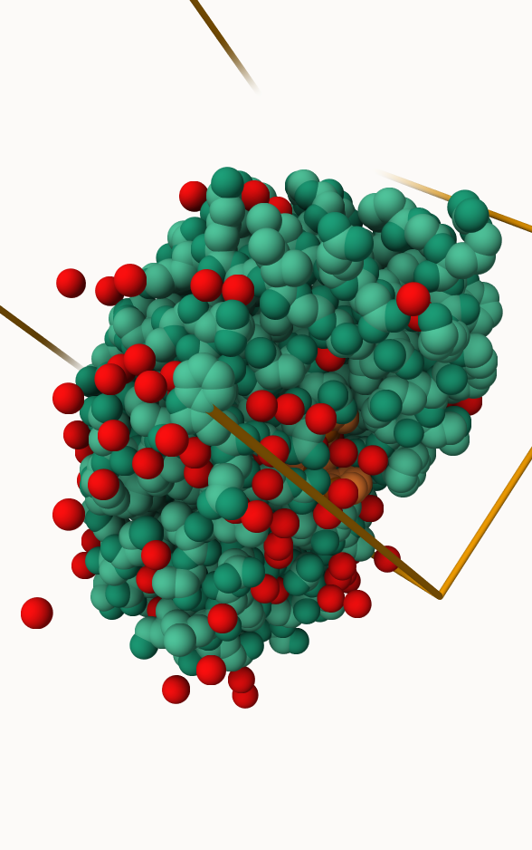
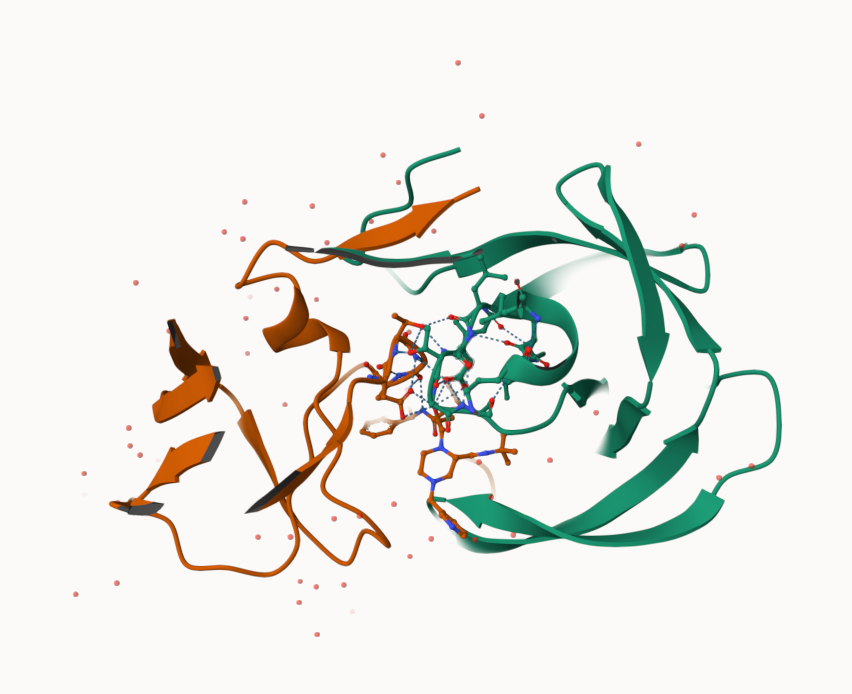
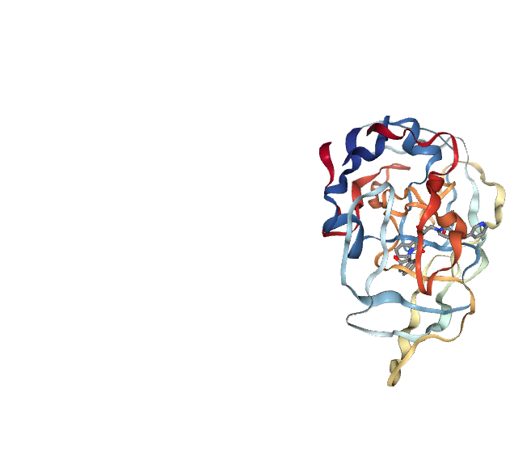
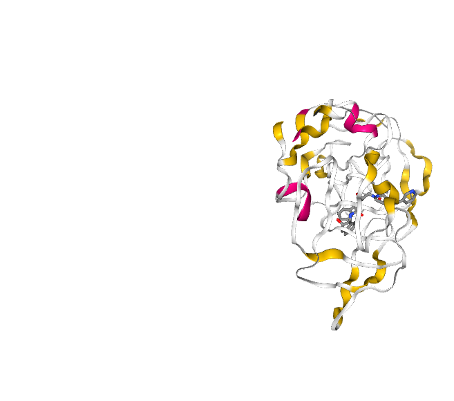
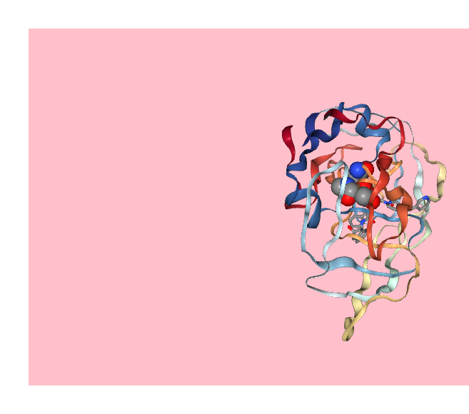

# class010: Structural Bioinformatics (pt. 1)
Kenny Dang (PID: A18544481)

## The PDB database

The [Protein Data Bank (PDB)](http://www.rcsb.org/) is the main
repository of biomolecular structure data. Let’s see what is in it:

``` r
PDB <- read.csv("pdb_stats.csv", row.names = 1)
PDB
```

                             X.ray    EM   NMR Integrative Multiple.methods Neutron
    Protein (only)          178795 21825 12773         343              226      84
    Protein/Oligosaccharide  10363  3564    34           8               11       1
    Protein/NA                9106  6335   287          24                7       0
    Nucleic acid (only)       3132   221  1566           3               15       3
    Other                      175    25    33           4                0       0
    Oligosaccharide (only)      11     0     6           0                1       0
                            Other  Total
    Protein (only)             32 214078
    Protein/Oligosaccharide     0  13981
    Protein/NA                  0  15759
    Nucleic acid (only)         1   4941
    Other                       0    237
    Oligosaccharide (only)      4     22

``` r
head(PDB)
```

                             X.ray    EM   NMR Integrative Multiple.methods Neutron
    Protein (only)          178795 21825 12773         343              226      84
    Protein/Oligosaccharide  10363  3564    34           8               11       1
    Protein/NA                9106  6335   287          24                7       0
    Nucleic acid (only)       3132   221  1566           3               15       3
    Other                      175    25    33           4                0       0
    Oligosaccharide (only)      11     0     6           0                1       0
                            Other  Total
    Protein (only)             32 214078
    Protein/Oligosaccharide     0  13981
    Protein/NA                  0  15759
    Nucleic acid (only)         1   4941
    Other                       0    237
    Oligosaccharide (only)      4     22

> Q1. What percentage of structures in the PDB are solved by X-Ray and
> Electron Microscopy.

81% of structures are solved by X-ray. 13% of structures are solved by
Electron Microscopy.

``` r
n.sums <- colSums(PDB)
n <- n.sums/n.sums["Total"]
round(n, digits = 2)
```

               X.ray               EM              NMR      Integrative 
                0.81             0.13             0.06             0.00 
    Multiple.methods          Neutron            Other            Total 
                0.00             0.00             0.00             1.00 

> Q2. What proportion of structures in the PDB are protein?

The proportion of structures in the PDB that are protein are 86%.

``` r
protein_total <- PDB["Protein (only)", "Total"]
protein_total
```

    [1] 214078

``` r
overall_total <- sum(PDB$Total)
overall_total
```

    [1] 249018

``` r
proportion <- protein_total / overall_total
proportion
```

    [1] 0.8596889

``` r
round(proportion, digits = 2)
```

    [1] 0.86

> Q3. Type HIV in the PDB website search box on the home page and
> determine how many HIV-1 protease structures are in the current PDB?

After typing HIV in the PDB website search box, there are 2,427 HIV-1
protease structures in the current PDB.

> What is the total number of entries in the PDB

The total number of entries in the PDB are 249018.

``` r
n.sums["Total"]
```

     Total 
    249018 

## Using Molstar

We can use the main \[Molstar viewer online\] (
https://molstar.org/viewer/)



> Q. Generate and Insert an image of the HIV-Pr cartoon colored by
> secondary structure, showing the inihibitor (ligand) in ball and
> stick.


> Q. One final image showing catalytic APS 25 as ball and stick and the
> all-important activties 

> Q4. Water molecules normally have 3 atoms. Why do we see just one atom
> per water molecule in this structure?

Water (H2O) has three atoms, but in X-ray crystallography the hydrogen
atoms barely scatter X-rays because they have very little electrons.
Only the oxygen atom has enough electrons too be easily identified by
the X-ray crystallography. Hydrogen atoms have very few electrons so it
contributes almost no signal so they are usually invisible in
electron-density maps. Meanwhile, the oxygen atom is detectable since it
is more electron-dense. Therefore, this is why we just see one atom per
water molecule in this structure.

> Q5. There is a critical “conserved” water molecule in the binding
> site. Can you identify this water molecule? What residue number does
> this water molecule have?

Yes I was able to identify the critical “conserved” water molecule in
the binding site. The water molecule is HOH 326 and it most likely
participates in catalysis.

> Q6. Generate and save a figure clearly showing the two distinct chains
> of HIV-protease along with the ligand. You might also consider showing
> the catalytic residues ASP 25 in each chain and the critical water (we
> recommend “Ball & Stick” for these side-chains). Add this figure to
> your Quarto document.



Discussion Topic: can you think of a way in which indinavir, or even
larger ligands and substrates could enter the binding site?

The indinavir and other larger ligands can enter the binding site
through transient opening of the flexible flap regions of the HIV-1
protease which provides access to the active site. So the ligand enters
when the flaps adopt an open conformation, the ligand diffuses into the
active site, and then the flaps close over the ligand, trapping it in
place. This is known as an induced fit.

``` r
library(bio3d)
```

    Warning: package 'bio3d' was built under R version 4.4.3

``` r
png1 <- read.pdb("1hsg")
```

      Note: Accessing on-line PDB file

``` r
png1
```


     Call:  read.pdb(file = "1hsg")

       Total Models#: 1
         Total Atoms#: 1686,  XYZs#: 5058  Chains#: 2  (values: A B)

         Protein Atoms#: 1514  (residues/Calpha atoms#: 198)
         Nucleic acid Atoms#: 0  (residues/phosphate atoms#: 0)

         Non-protein/nucleic Atoms#: 172  (residues: 128)
         Non-protein/nucleic resid values: [ HOH (127), MK1 (1) ]

       Protein sequence:
          PQITLWQRPLVTIKIGGQLKEALLDTGADDTVLEEMSLPGRWKPKMIGGIGGFIKVRQYD
          QILIEICGHKAIGTVLVGPTPVNIIGRNLLTQIGCTLNFPQITLWQRPLVTIKIGGQLKE
          ALLDTGADDTVLEEMSLPGRWKPKMIGGIGGFIKVRQYDQILIEICGHKAIGTVLVGPTP
          VNIIGRNLLTQIGCTLNF

    + attr: atom, xyz, seqres, helix, sheet,
            calpha, remark, call

``` r
head(png1$atom)
```

      type eleno elety  alt resid chain resno insert      x      y     z o     b
    1 ATOM     1     N <NA>   PRO     A     1   <NA> 29.361 39.686 5.862 1 38.10
    2 ATOM     2    CA <NA>   PRO     A     1   <NA> 30.307 38.663 5.319 1 40.62
    3 ATOM     3     C <NA>   PRO     A     1   <NA> 29.760 38.071 4.022 1 42.64
    4 ATOM     4     O <NA>   PRO     A     1   <NA> 28.600 38.302 3.676 1 43.40
    5 ATOM     5    CB <NA>   PRO     A     1   <NA> 30.508 37.541 6.342 1 37.87
    6 ATOM     6    CG <NA>   PRO     A     1   <NA> 29.296 37.591 7.162 1 38.40
      segid elesy charge
    1  <NA>     N   <NA>
    2  <NA>     C   <NA>
    3  <NA>     C   <NA>
    4  <NA>     O   <NA>
    5  <NA>     C   <NA>
    6  <NA>     C   <NA>

``` r
pdbseq(png1)
```

      1   2   3   4   5   6   7   8   9  10  11  12  13  14  15  16  17  18  19  20 
    "P" "Q" "I" "T" "L" "W" "Q" "R" "P" "L" "V" "T" "I" "K" "I" "G" "G" "Q" "L" "K" 
     21  22  23  24  25  26  27  28  29  30  31  32  33  34  35  36  37  38  39  40 
    "E" "A" "L" "L" "D" "T" "G" "A" "D" "D" "T" "V" "L" "E" "E" "M" "S" "L" "P" "G" 
     41  42  43  44  45  46  47  48  49  50  51  52  53  54  55  56  57  58  59  60 
    "R" "W" "K" "P" "K" "M" "I" "G" "G" "I" "G" "G" "F" "I" "K" "V" "R" "Q" "Y" "D" 
     61  62  63  64  65  66  67  68  69  70  71  72  73  74  75  76  77  78  79  80 
    "Q" "I" "L" "I" "E" "I" "C" "G" "H" "K" "A" "I" "G" "T" "V" "L" "V" "G" "P" "T" 
     81  82  83  84  85  86  87  88  89  90  91  92  93  94  95  96  97  98  99   1 
    "P" "V" "N" "I" "I" "G" "R" "N" "L" "L" "T" "Q" "I" "G" "C" "T" "L" "N" "F" "P" 
      2   3   4   5   6   7   8   9  10  11  12  13  14  15  16  17  18  19  20  21 
    "Q" "I" "T" "L" "W" "Q" "R" "P" "L" "V" "T" "I" "K" "I" "G" "G" "Q" "L" "K" "E" 
     22  23  24  25  26  27  28  29  30  31  32  33  34  35  36  37  38  39  40  41 
    "A" "L" "L" "D" "T" "G" "A" "D" "D" "T" "V" "L" "E" "E" "M" "S" "L" "P" "G" "R" 
     42  43  44  45  46  47  48  49  50  51  52  53  54  55  56  57  58  59  60  61 
    "W" "K" "P" "K" "M" "I" "G" "G" "I" "G" "G" "F" "I" "K" "V" "R" "Q" "Y" "D" "Q" 
     62  63  64  65  66  67  68  69  70  71  72  73  74  75  76  77  78  79  80  81 
    "I" "L" "I" "E" "I" "C" "G" "H" "K" "A" "I" "G" "T" "V" "L" "V" "G" "P" "T" "P" 
     82  83  84  85  86  87  88  89  90  91  92  93  94  95  96  97  98  99 
    "V" "N" "I" "I" "G" "R" "N" "L" "L" "T" "Q" "I" "G" "C" "T" "L" "N" "F" 

> Q7. How many amino acid residues are there in this pdb object?

``` r
# Counts amino‑acid residues across all chains in a PDB object
aa_filter <- png1$atom$resid %in% c(
  "ALA","ARG","ASN","ASP","CYS",
  "GLU","GLN","GLY","HIS","ILE",
  "LEU","LYS","MET","PHE","PRO",
  "SER","THR","TRP","TYR","VAL"
)
pairs <- paste(
  png1$atom$chain[aa_filter],
  png1$atom$resno[aa_filter],
  sep = "_"
)
length(unique(pairs))
```

    [1] 198

> Q8. Name one of the two non-protein residues?

HOH is one of the two non-protein residue.

``` r
unique(png1$atom$resid)
```

     [1] "PRO" "GLN" "ILE" "THR" "LEU" "TRP" "ARG" "VAL" "LYS" "GLY" "GLU" "ALA"
    [13] "ASP" "MET" "SER" "PHE" "TYR" "CYS" "HIS" "ASN" "MK1" "HOH"

> Q9. How many protein chains are in this structure?

There are 2 protein chains in this structure.

``` r
aa <- c("ALA","ARG","ASN","ASP","CYS",
        "GLU","GLN","GLY","HIS","ILE",
        "LEU","LYS","MET","PHE","PRO",
        "SER","THR","TRP","TYR","VAL")

aa_filter <- png1$atom$resid %in% aa

protein_chains <- unique(png1$atom$chain[aa_filter])
length(protein_chains)
```

    [1] 2

### Install – Install packages in the R console NOT your Rmd/Quarto file

install.packages(“bio3d”) install.packages(“NGLVieweR”)

install.packages(“remotes”) remotes::install_github(“bioboot/bio3dview”)

install.packages(“BiocManager”) BiocManager::install(“msa”)

> Q10. Which of the packages above is found only on BioConductor and not
> CRAN?

msa is found onnly on BioConductor and not CRAN.

> Q11. Which of the above packages is not found on BioConductor or CRAN?

bio3dview is not found on BioConductor or CRAN.

> Q12. True or False? Functions from the pak package can be used to
> install packages from GitHub and BitBucket?

TRUE

Let’s try out the new **bio3dview** package that is not yet on CRAN We
can use the **remotes** package to install any R package from GitHub.

``` r
library(bio3dview)

view.pdb(png1)
```



``` r
view.pdb(png1, colorScheme = "sse")
```



## Quick viewing of PDBs

``` r
library(bio3dview)

sele <- atom.select(png1, resno=25)

view.pdb(png1, backgroundColor = "pink",
         highlight = sele,
         highlight.style = "spacefill")
```



### Prediction of Protein Flexibility

``` r
adk <- read.pdb("6s36")
```

      Note: Accessing on-line PDB file
       PDB has ALT records, taking A only, rm.alt=TRUE

``` r
m <- nma(adk)
```

     Building Hessian...        Done in 0.01 seconds.
     Diagonalizing Hessian...   Done in 0.14 seconds.

``` r
plot(m)
```


Write out our results as a wee trajectory movie:

mktrj(m, file=“results.pdb”)

view.nma(m)

``` r
library(bio3d)

aa <- get.seq("1ake_A")
```

    Warning in get.seq("1ake_A"): Removing existing file: seqs.fasta

    Fetching... Please wait. Done.

``` r
aa
```

                 1        .         .         .         .         .         60 
    pdb|1AKE|A   MRIILLGAPGAGKGTQAQFIMEKYGIPQISTGDMLRAAVKSGSELGKQAKDIMDAGKLVT
                 1        .         .         .         .         .         60 

                61        .         .         .         .         .         120 
    pdb|1AKE|A   DELVIALVKERIAQEDCRNGFLLDGFPRTIPQADAMKEAGINVDYVLEFDVPDELIVDRI
                61        .         .         .         .         .         120 

               121        .         .         .         .         .         180 
    pdb|1AKE|A   VGRRVHAPSGRVYHVKFNPPKVEGKDDVTGEELTTRKDDQEETVRKRLVEYHQMTAPLIG
               121        .         .         .         .         .         180 

               181        .         .         .   214 
    pdb|1AKE|A   YYSKEAEAGNTKYAKVDGTKPVAEVRADLEKILG
               181        .         .         .   214 

    Call:
      read.fasta(file = outfile)

    Class:
      fasta

    Alignment dimensions:
      1 sequence rows; 214 position columns (214 non-gap, 0 gap) 

    + attr: id, ali, call

> Q13. How many amino acids are in this sequence, i.e. how long is this
> sequence?

There are 214 amino acids in this sequence.

``` r
length(aa$ali)
```

    [1] 214
