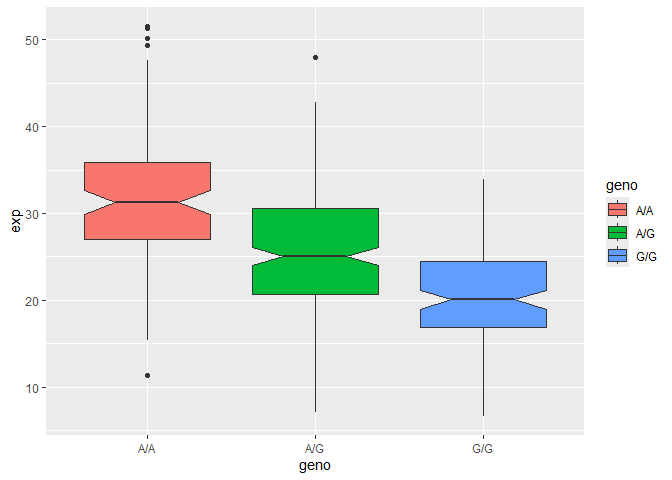
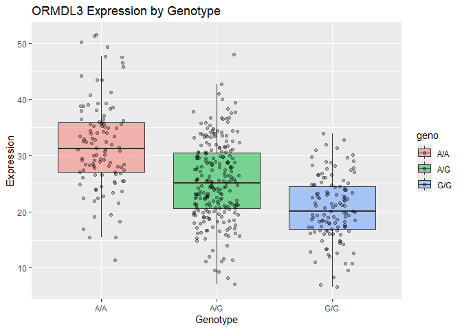

# class12
Kenny Dang (PID: A18544481)

# Section 1. Proportion og G/G in a population

Downloaded a CSV file from Ensemble \<

https://www.ensembl.org/Homo_sapiens/Variation/Sample?db=core;r=17:39800165-39990166;v=rs8067378;vdb=variation;vf=959672880;sample=MXL#373531_tablePanel

Here we read this CSV file

``` r
mxl <- read.csv("HSdata.csv")
head(mxl)
```

      Sample..Male.Female.Unknown. Genotype..forward.strand. Population.s. Father
    1                  NA19648 (F)                       A|A ALL, AMR, MXL      -
    2                  NA19649 (M)                       G|G ALL, AMR, MXL      -
    3                  NA19651 (F)                       A|A ALL, AMR, MXL      -
    4                  NA19652 (M)                       G|G ALL, AMR, MXL      -
    5                  NA19654 (F)                       G|G ALL, AMR, MXL      -
    6                  NA19655 (M)                       A|G ALL, AMR, MXL      -
      Mother
    1      -
    2      -
    3      -
    4      -
    5      -
    6      -

``` r
table(mxl$Genotype..forward.strand.)
```


    A|A A|G G|A G|G 
     22  21  12   9 

``` r
table(mxl$Genotype..forward.strand.)/nrow(mxl) * 100
```


        A|A     A|G     G|A     G|G 
    34.3750 32.8125 18.7500 14.0625 

Now let’s look at a different population. I picked the GBR.

``` r
gbr <- read.csv("GBRdata.csv")
```

Find proportion of G\|G

``` r
round(table(gbr$Genotype..forward.strand.)/nrow(gbr) * 100,2)
```


      A|A   A|G   G|A   G|G 
    25.27 18.68 26.37 29.67 

This variant that is associated with childhood asthma is more frequent
in the GBR population than the MKL population.

Let’s now dig into this further.

## Section 4: Population Scale Analysis

One sample is obviously not enough to know what is happening in a
population. You are interested in assessing genetic differences on a
population scale.

So, you processed about ~230 samples and did the normalization on a
genome level. Now, you want to find whether there is any association of
the 4 asthma-associated SNPs (rs8067378…) on ORMDL3 expression.

How many samples do we have?

``` r
expr <- read.table("gen1.txt")

head(expr)
```

       sample geno      exp
    1 HG00367  A/G 28.96038
    2 NA20768  A/G 20.24449
    3 HG00361  A/A 31.32628
    4 HG00135  A/A 34.11169
    5 NA18870  G/G 18.25141
    6 NA11993  A/A 32.89721

``` r
nrow(expr)
```

    [1] 462

``` r
table(expr$geno)
```


    A/A A/G G/G 
    108 233 121 

``` r
library(ggplot2)
```

    Warning: package 'ggplot2' was built under R version 4.4.3

Lets make a boxplot

``` r
ggplot(expr) + aes(x=geno, y = exp, fill=geno) + geom_boxplot(notch=TRUE)
```



> Q13. Read this file into R and determine the sample size for each
> genotype and their corresponding median expression levels for each of
> these genotypes. Hint: The read.table(),summary() and boxplot()
> functions will likely be useful here. There is an example R script
> online to be used ONLY if you are struggling in vein. Note that you
> can find the medium value from saving the output of the boxplot()
> function to an R object and examining this object. There is also the
> medium() and summary() function that you can use to check your
> understanding.

The total number of samples is 462. The sample size for the A/A genotype
is 108 and its median expression level is 31.25. The sample size for the
A/G genotype is 233 and its median expression level is 25.06. The sample
size for the G/G genotype is 121 and its median expression level is
20.07.

``` r
expr <- read.table("gen1.txt")

head(expr)
```

       sample geno      exp
    1 HG00367  A/G 28.96038
    2 NA20768  A/G 20.24449
    3 HG00361  A/A 31.32628
    4 HG00135  A/A 34.11169
    5 NA18870  G/G 18.25141
    6 NA11993  A/A 32.89721

``` r
summary(expr)
```

        sample              geno                exp        
     Length:462         Length:462         Min.   : 6.675  
     Class :character   Class :character   1st Qu.:20.004  
     Mode  :character   Mode  :character   Median :25.116  
                                           Mean   :25.640  
                                           3rd Qu.:30.779  
                                           Max.   :51.518  

``` r
table(expr$geno)
```


    A/A A/G G/G 
    108 233 121 

``` r
aggregate(exp ~ geno, data = expr, FUN = median)
```

      geno      exp
    1  A/A 31.24847
    2  A/G 25.06486
    3  G/G 20.07363

``` r
data.frame(
  genotype = names(tapply(expr$exp, expr$geno, median)),
  n        = as.vector(table(expr$geno)),
  median   = round(tapply(expr$exp, expr$geno, median, na.rm = TRUE), 2)
)
```

        genotype   n median
    A/A      A/A 108  31.25
    A/G      A/G 233  25.06
    G/G      G/G 121  20.07

> Q14. Generate a boxplot with a box per genotype, what could you infer
> from the relative expression value between A/A and G/G displayed in
> this plot? Does the SNP effect the expression of ORMDL3? Hint: An
> example boxplot is provided overleaf – yours does not need to be as
> polished as this one.

The genotype A/A has the highest median expression level, then the
genotype A/G has the second highest median expression level, and lastly
the genotype G/G has the lowest median expression level. The median
expression level decreases as the number of G alleles increase and so in
other words, the G allele is associated with reduced gene expression.
The boxplot indicates that there is a dose-dependent effect of the G
allele. Yes, the SNP affects the expression of ORMDL3. ORMDL3 expression
is highest in individuals with the A/A genotype, intermediate in
individuals with the A/G genotype, and lowest in individuals with the
G/G genotype.

``` r
ggplot(expr, aes(x = geno, y = exp, fill = geno)) +
  geom_boxplot(outlier.shape = NA, alpha = 0.5) +
  geom_jitter(width = 0.2, color = "black", alpha = 0.3) +
  labs(
    title = "ORMDL3 Expression by Genotype",
    x = "Genotype",
    y = "Expression"
  )
```


