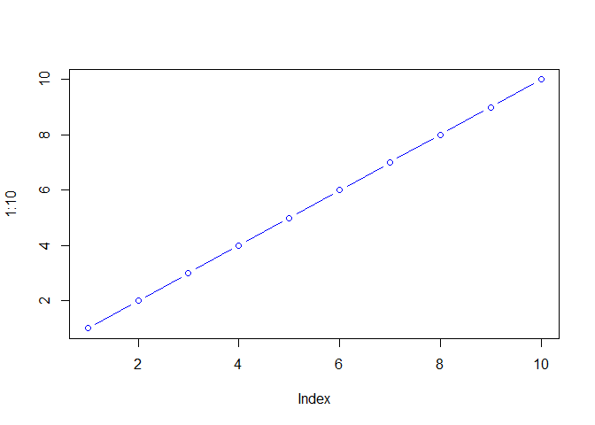

# class06: R Functions
Kenny (PID: 18544481)

- [Background](#background)
- [A first function](#a-first-function)
- [A second function](#a-second-function)
- [A new cool function](#a-new-cool-function)

## Background

Functions are at the heart of using R. Everything we do involves calling
and using functions (from data input, analysis to results output)

All functions in R have at least 3 things:

- A **name** the thing we use to call the function.
- One or more input **arguments** that are comma separated
- The **body**, lines of code between curly brackets { } that does the
  work of the function

## A first function

Let’s write a silly wee function to add some numbers:

``` r
add <- function (x) {  
  x+1
  }
```

Let’s try it out

``` r
add(103)
```

    [1] 104

Will this work

``` r
add(c(100, 200, 300) )
```

    [1] 101 201 301

Modify to be more useful and add more than just 1

``` r
add <- function (x, y=1) {  
  x+y
  }
```

``` r
add (100,10)
```

    [1] 110

Will this work?

``` r
add <- function (x) {  
  100
  }
```

``` r
plot (1:10, col= "blue", typ = "b")
```



``` r
log(10, base = 10)
```

    [1] 1

``` r
add(100)
```

    [1] 100

> **N.B.** Input arguments can be either **required** or **optional**.
> The later have a fall-back default that is specified in the function
> code with an equals sign.

``` r
#add (x=100, y=200, z=300)
```

## A second function

All functions in R look like this

``` r
name <- function(arg) {
  body
}
```

The `sample()` function in R takes a sample of the specified size from
the element of x using either with or without replacement. Essentially,
it randomly selects items from a vector.

``` r
sample(1:10, size = 5) 
```

    [1]  9  2  3 10  1

> Q. Return 12 numbers picked randomly from the input 1:10

``` r
sample(1:10, size=12, replace = TRUE)
```

     [1]  2  9 10  9  2  1  1  8 10  5  2 10

> Q. Write the code to generate a random 12 nucleotide long DNA
> sequence?

``` r
sample(c("A","T","C","G"), size=12, replace = TRUE)
```

     [1] "T" "C" "G" "G" "A" "G" "C" "G" "G" "G" "T" "G"

> Q. Write a first version function called `generate_dna()` that
> generates a user specified length `n` random DNA sequence?

``` r
name <- function (arg) {
body
}
```

``` r
generate_dna <- function(n=6) {
  bases <- c ("A", "T", "C", "G")
  sample (bases, size=n, replace=TRUE)
}
```

``` r
generate_dna(100)
```

      [1] "C" "C" "C" "G" "C" "T" "G" "A" "A" "C" "G" "A" "T" "T" "T" "C" "T" "T"
     [19] "C" "C" "G" "A" "G" "C" "T" "T" "G" "T" "G" "A" "G" "G" "T" "C" "C" "C"
     [37] "A" "A" "T" "T" "A" "A" "C" "A" "G" "T" "A" "T" "A" "G" "T" "G" "C" "T"
     [55] "G" "C" "T" "C" "C" "C" "A" "G" "T" "A" "T" "A" "A" "T" "G" "C" "T" "G"
     [73] "A" "A" "A" "G" "C" "G" "T" "C" "A" "C" "T" "A" "A" "G" "G" "C" "A" "A"
     [91] "A" "T" "G" "A" "T" "A" "A" "A" "C" "C"

> Q. Modify your function to return a FASTA like sequence so rather than
> \[1\] “G” “C” “A” “A” “t” we want “GCAAT”

``` r
generate_dna <- function(n=6) {
  S1 <- sample (c("A", "T", "C", "G"), size=n, replace=TRUE)
  paste (S1, collapse = "")
}
generate_dna(5)
```

    [1] "ATTCA"

> Q. Give the user an option to return FASTA format ouput sequence or
> standard multi-element vector format?

``` r
generate_dna <- function (n=6, fasta=TRUE) {
bases <- c("A", "C", "G", "T")
ans<- sample (bases, size=n, replace =TRUE)

if(fasta) {
    ans <- paste (ans, collapse = "")
    cat("Hello...")
} else {
  cat ("... is it me you are looking for")
}
return(ans)
}
```

``` r
generate_dna(10)
```

    Hello...

    [1] "AGTTTTGTTA"

``` r
generate_dna(10, fasta=F)
```

    ... is it me you are looking for

     [1] "G" "C" "A" "G" "G" "T" "C" "C" "C" "C"

## A new cool function

> Q. Write a function called `generate_protein()` that generates a user
> specified length protein sequence in FASTA like format?

``` r
generate_protein <- function(n=7) {
  aa <- sample (c ("A", "R", "N", "D", "C",
           "Q", "E", "G", "H", "I", 
           "L", "K", "M", "F", "P",
           "S", "T", "W", "Y", "V"), size = n, replace = TRUE)
  paste (aa, collapse = "")
}
generate_protein(7)
```

    [1] "IRNKSHY"

generate_dna \<- function(n=6) { S1 \<- sample (c(“A”, “T”, “C”, “G”),
size=n, replace=TRUE) paste (S1, collapse = ““) } generate_dna(5)

> Q. Use your new `generate_protein()` function to generate sequences
> between length 6 and 12 amino-acids in length and check if any of
> these are unique in nature (i.e. found in the NR database at NCBI)?

``` r
generate_protein <- function(n=7) {
  aa <- sample (c ("A", "R", "N", "D", "C",
           "Q", "E", "G", "H", "I", 
           "L", "K", "M", "F", "P",
           "S", "T", "W", "Y", "V"), size = n, replace = TRUE)
  paste (aa, collapse = "")
}

generate_protein(6)
```

    [1] "PGPNAQ"

or we could do a `for()` loop:

``` r
for(i in 6:12) {
  cat(">", i, sep="", "\n")
  cat(generate_protein(i), "\n")
}
```

    >6
    YNGNPH 
    >7
    MFDYHVC 
    >8
    AWGCHGCC 
    >9
    LPCQCVMGW 
    >10
    PGIVSSGWPK 
    >11
    HFFDAYQLEGA 
    >12
    FIGNVNHSYHCQ 
