# CLASS07LAB
Kenny Dang (PID:A18544481)

- [Background](#background)
- [K-means clustering](#k-means-clustering)
- [Hierarchical Clustering](#hierarchical-clustering)
- [should be two columns](#should-be-two-columns)
- [PCA of UK food data](#pca-of-uk-food-data)
- [Spotting major differences and
  trends](#spotting-major-differences-and-trends)
- [setting the “beside” equal to
  FALSE](#setting-the-beside-equal-to-false)
  - [Pairs plots and heatmaps](#pairs-plots-and-heatmaps)
- [PCA to the rescue](#pca-to-the-rescue)

## Background

Today we will begin our exploration of some important machine learning
methods namely **clustering** and **dimensionality reduction**.

Let’s make up some input data for clustering where we know what the
natural “clusters” are

The function `rnorm()` can be useful here

``` r
hist(rnorm(5000, 10))
```

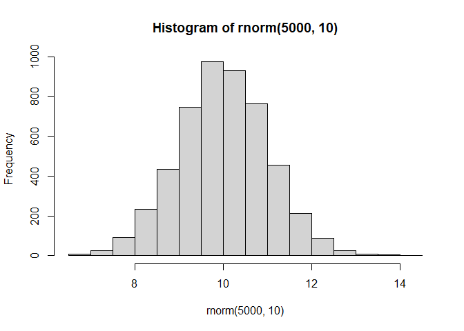

> Q. generate 30 random numbers centered at +3

``` r
rnorm(30, 3)
```

     [1] 1.1990097 4.5600612 3.6691983 2.9022630 0.7310592 3.7476548 2.1194895
     [8] 3.5413145 4.4992796 5.2219841 3.6090220 3.6060341 3.0119415 3.1573646
    [15] 3.2079949 3.9235568 2.0037811 2.6377085 2.1596614 3.0443886 3.0050107
    [22] 1.9823760 2.6411938 1.7979065 1.4306680 1.7933115 3.0922302 1.5173557
    [29] 2.5274891 3.4774474

``` r
rnorm(30, -3)
```

     [1] -4.156766 -3.827512 -1.587108 -3.144667 -3.853875 -1.939404 -1.834437
     [8] -1.813109 -3.390422 -3.355889 -3.455658 -3.417290 -2.243988 -2.926645
    [15] -3.749351 -3.757449 -3.169975 -3.449605 -3.147716 -2.005206 -2.482952
    [22] -1.890688 -3.778892 -2.846227 -2.561274 -3.727384 -2.223687 -1.524196
    [29] -3.085140 -4.111527

> Q. generate 30 random numbers centered at -3

``` r
rnorm(30, -3)
```

     [1] -2.537346 -3.498229 -2.135510 -2.875696 -2.807054 -3.301632 -3.384569
     [8] -2.837798 -2.383284 -4.013971 -3.910435 -2.877975 -2.038767 -2.667361
    [15] -2.931009 -1.465544 -4.213256 -4.027384 -3.014999 -3.161812 -1.469073
    [22] -2.729863 -5.975527 -1.933548 -2.179516 -4.000563 -3.392198 -2.087027
    [29] -4.249270 -3.296867

``` r
tmp <- c(rnorm(30, 3), rnorm(30, -3))
tmp
```

     [1]  3.0854948  2.9107744  3.5907139  3.2670757  2.7936453  3.2093141
     [7]  4.0871340  1.6822202  4.2168925  3.2115507  4.9266618  3.4578945
    [13]  4.6975922  2.1874410  3.4993640  2.3525613  2.7706302  2.9787372
    [19]  3.3763494  3.5169082  3.2502269  3.1571227  2.7455177  2.5523231
    [25]  1.2892734  3.3588214  5.7371419  2.8695218  2.2125605  3.0460297
    [31] -2.3698816 -3.3206458 -3.5153032 -3.6197253 -1.0722627 -1.0395219
    [37] -2.8621106 -3.4417134 -2.8786436 -3.2370347 -2.7479523 -2.6233053
    [43] -1.3337120 -1.9372421 -3.3488611 -0.7991306 -2.1326768 -1.5355173
    [49] -2.0266266 -2.8626304 -0.5800923 -4.1003199 -1.7321446 -2.4735209
    [55] -2.3767780 -4.8924701 -4.0929162 -4.1777714 -4.2959780 -3.2816797

``` r
x <- cbind(x=tmp, y=rev(tmp))
plot(x)
```

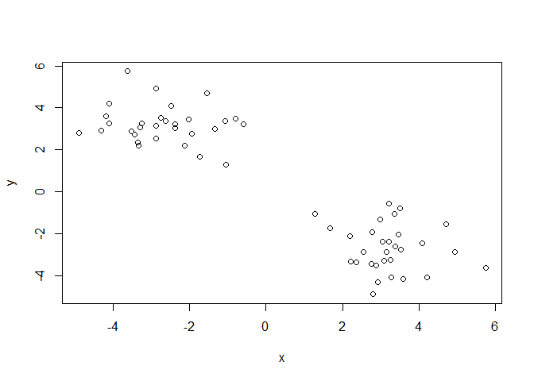

``` r
rev(letters)
```

     [1] "z" "y" "x" "w" "v" "u" "t" "s" "r" "q" "p" "o" "n" "m" "l" "k" "j" "i" "h"
    [20] "g" "f" "e" "d" "c" "b" "a"

## K-means clustering

The main function in “base R” for K-means clustering is called
`kmeans()`:

``` r
tmp <- c(rnorm(30, 3), rnorm(30, -3))
tmp
```

     [1]  2.9586368  2.3703195  1.7679106  3.7438391  2.9154480  2.3191924
     [7]  2.9737830  2.9885770  2.4536888  0.3984674  2.5186951  3.4523598
    [13]  4.0114800  2.7872722  3.0773630  1.3020621  3.7813450  5.5613563
    [19]  2.3725749  3.1169854  4.3059016  3.7383931  3.2171883  3.0403924
    [25]  3.1725432  4.4751703  1.1743859  3.6917301  2.3620758  1.4123950
    [31] -3.1035684 -2.2742160 -4.0005632 -3.6549311 -3.9852141 -2.5374145
    [37] -2.6731621 -2.6068702 -3.0336303 -3.0946038 -3.0338390 -3.3491524
    [43] -3.1746349 -1.4673544 -3.3221295 -2.1910426 -2.5701846 -1.9034613
    [49] -2.4341295 -3.3980171 -3.6031772 -2.6984391 -4.2330812 -2.8149634
    [55] -4.4690560 -4.9263281 -3.5757482 -3.0819005 -2.4538844 -4.1634809

``` r
x <- cbind(x=tmp, y=rev(tmp))

km <- kmeans(x, 2)
km
```

    K-means clustering with 2 clusters of sizes 30, 30

    Cluster means:
              x         y
    1 -3.127606  2.915384
    2  2.915384 -3.127606

    Clustering vector:
     [1] 2 2 2 2 2 2 2 2 2 2 2 2 2 2 2 2 2 2 2 2 2 2 2 2 2 2 2 2 2 2 1 1 1 1 1 1 1 1
    [39] 1 1 1 1 1 1 1 1 1 1 1 1 1 1 1 1 1 1 1 1 1 1

    Within cluster sum of squares by cluster:
    [1] 50.93886 50.93886
     (between_SS / total_SS =  91.5 %)

    Available components:

    [1] "cluster"      "centers"      "totss"        "withinss"     "tot.withinss"
    [6] "betweenss"    "size"         "iter"         "ifault"      

> Q. What component of the results object details the cluster sizes?

``` r
km$size
```

    [1] 30 30

> Q. What components of the results object details the cluster centers?

``` r
km$centers
```

              x         y
    1 -3.127606  2.915384
    2  2.915384 -3.127606

> Q. What components of the results object details the cluster
> membership vector (i.e. our main result of which points lie in which
> cluster)?

``` r
km$cluster
```

     [1] 2 2 2 2 2 2 2 2 2 2 2 2 2 2 2 2 2 2 2 2 2 2 2 2 2 2 2 2 2 2 1 1 1 1 1 1 1 1
    [39] 1 1 1 1 1 1 1 1 1 1 1 1 1 1 1 1 1 1 1 1 1 1

> Q. Plot our clustering results with points colored by cluster and also
> add the cluster centers as new points colored blue?

``` r
plot(x, col=km$cluster)
points(km$centers, col ="blue", pch=15)
```

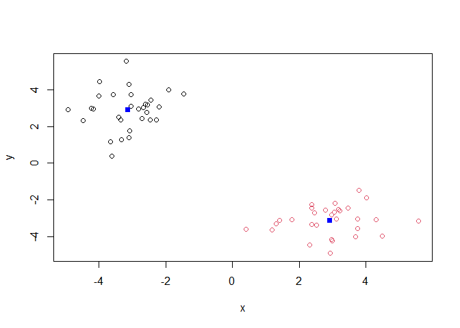

> Q. Run `kmeans()` again and this time produce 4 clusters (and call
> your result object `k4`) and make a results figure like above?

``` r
tmp <- c(rnorm(30, 3), rnorm(30, -3))
tmp
```

     [1]  2.1014393  2.7641136  3.6265081  4.1519552  3.1452038  3.2705577
     [7]  3.4889260  2.5056191  2.3585311  3.2785391  2.8920542  2.5833941
    [13]  3.0338667  4.1157172  2.9521654  3.2179327  3.9861737  0.5438574
    [19]  4.2575662  1.3629203  3.1443602  2.6991407  5.0463346  3.4842375
    [25]  4.5209543  3.7538843  2.7909167  1.0867794  2.4011856  1.5859826
    [31] -2.7920111 -3.5288142 -3.3327354 -2.7669199 -3.5987637 -3.9396074
    [37] -2.3719198 -3.9205666 -2.6060566 -2.1946388 -3.6712044 -4.1229554
    [43] -2.0375039 -1.5894017 -1.4450148 -2.1019411 -1.2081103 -1.6874914
    [49] -1.8794582 -2.9844158 -3.4595564 -1.4760473 -3.8668399 -1.8781079
    [55] -1.7871861 -0.8703560 -2.8515013 -3.7773296 -2.7304252 -3.1269392

``` r
x <- cbind(x=tmp, y=rev(tmp))

k4 <- kmeans(x,4)
plot(x, col=k4$cluster)
points(k4$centers, col ="blue", pch=15)
```

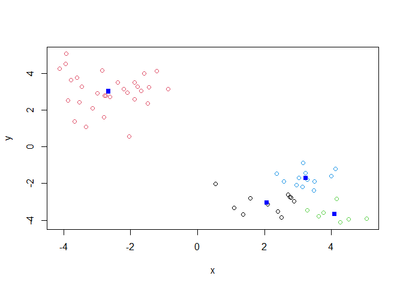

The metric

``` r
km$tot.withinss
```

    [1] 101.8777

``` r
k4$tot.withinss
```

    [1] 72.57224

> Q. Let’s try different number of K(centers) from 1 to 30 and see what
> the best result is?

``` r
i <- 1
ans <- NULL
for (i in 1:30) {
ans <- c(ans, kmeans(x, centers = i)$tot.withinss)
}

ans
```

     [1] 1071.259419  110.704866   91.252937   71.044069   68.473216   65.220585
     [7]   30.340588   27.406097   41.730728   20.192841   18.672405   16.280250
    [13]   17.265041   12.988247   12.963563   17.952623   10.671759    9.548119
    [19]    9.092949    8.430208    7.188514    8.207402    6.211853    5.475169
    [25]    5.356915    5.024959    4.771129    4.134741    2.906711    4.691756

``` r
plot(ans, typ="o")
```

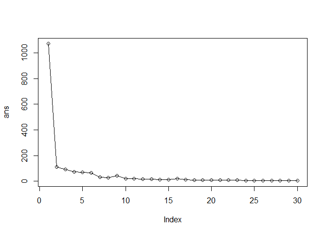

**Key-point:** K-means will impose a clustering structure on your data
even if it is not there - it will always give you the answer you asked
for even if that answer is silly!

## Hierarchical Clustering

The main function for Hierarchical Clustering is called `hclust()`.
Unlike `kmeans()` (which does all the work for you) you can’t just pass
`hclust()` our raw input data. It needs a “distance matrix” like the one
returned from the `dist()` function.

``` r
d <- dist(x)
hc <- hclust(d)
plot(hc)
```

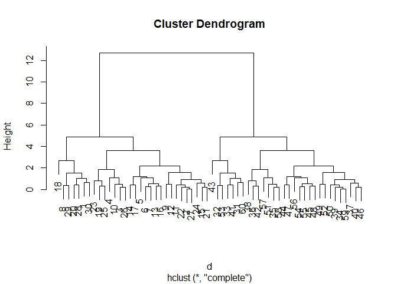

To extract our cluster membership vector from a `hclust()`result object
we have to “cut” our tree at a given hieght to yield separate
“groups”/“branches”.

``` r
plot(hc)
abline(h=8, col="red", lty=2)
```

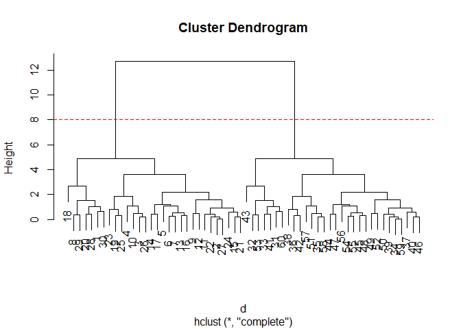

To do this we use the `cutree()` function on our `hclust()` object:

``` r
grps <- cutree(hc, h=8)
grps
```

     [1] 1 1 1 1 1 1 1 1 1 1 1 1 1 1 1 1 1 1 1 1 1 1 1 1 1 1 1 1 1 1 2 2 2 2 2 2 2 2
    [39] 2 2 2 2 2 2 2 2 2 2 2 2 2 2 2 2 2 2 2 2 2 2

## should be two columns

``` r
tab <- table(grps, km$cluster)
tab[, c(2,1)]
```

        
    grps  2  1
       1 30  0
       2  0 30

## PCA of UK food data

Import the dataset of food consumption in the UK:

``` r
url <- "https://tinyurl.com/UK-foods"
x <- read.csv(url)
x
```

                         X England Wales Scotland N.Ireland
    1               Cheese     105   103      103        66
    2        Carcass_meat      245   227      242       267
    3          Other_meat      685   803      750       586
    4                 Fish     147   160      122        93
    5       Fats_and_oils      193   235      184       209
    6               Sugars     156   175      147       139
    7      Fresh_potatoes      720   874      566      1033
    8           Fresh_Veg      253   265      171       143
    9           Other_Veg      488   570      418       355
    10 Processed_potatoes      198   203      220       187
    11      Processed_Veg      360   365      337       334
    12        Fresh_fruit     1102  1137      957       674
    13            Cereals     1472  1582     1462      1494
    14           Beverages      57    73       53        47
    15        Soft_drinks     1374  1256     1572      1506
    16   Alcoholic_drinks      375   475      458       135
    17      Confectionery       54    64       62        41

> Q1. How many rows and columns are in your new data frame named x? What
> R functions could you use to answer this questions?

There are 17 rows and 5 columns. I used the dim() function to find the
answer for this.

``` r
dim(x)
```

    [1] 17  5

One solution to set the row names is to do it by hand…

``` r
rownames(x) <- x[, 1]
rownames(x)
```

     [1] "Cheese"              "Carcass_meat "       "Other_meat "        
     [4] "Fish"                "Fats_and_oils "      "Sugars"             
     [7] "Fresh_potatoes "     "Fresh_Veg "          "Other_Veg "         
    [10] "Processed_potatoes " "Processed_Veg "      "Fresh_fruit "       
    [13] "Cereals "            "Beverages"           "Soft_drinks "       
    [16] "Alcoholic_drinks "   "Confectionery "     

To remove the first column I can use the minus index trick

``` r
x <- x[, -1]
x
```

                        England Wales Scotland N.Ireland
    Cheese                  105   103      103        66
    Carcass_meat            245   227      242       267
    Other_meat              685   803      750       586
    Fish                    147   160      122        93
    Fats_and_oils           193   235      184       209
    Sugars                  156   175      147       139
    Fresh_potatoes          720   874      566      1033
    Fresh_Veg               253   265      171       143
    Other_Veg               488   570      418       355
    Processed_potatoes      198   203      220       187
    Processed_Veg           360   365      337       334
    Fresh_fruit            1102  1137      957       674
    Cereals                1472  1582     1462      1494
    Beverages                57    73       53        47
    Soft_drinks            1374  1256     1572      1506
    Alcoholic_drinks        375   475      458       135
    Confectionery            54    64       62        41

A better way to do this is to set the row names to the first column with
`read.csv()`

``` r
x <- read.csv(url, row.names = 1)
x
```

                        England Wales Scotland N.Ireland
    Cheese                  105   103      103        66
    Carcass_meat            245   227      242       267
    Other_meat              685   803      750       586
    Fish                    147   160      122        93
    Fats_and_oils           193   235      184       209
    Sugars                  156   175      147       139
    Fresh_potatoes          720   874      566      1033
    Fresh_Veg               253   265      171       143
    Other_Veg               488   570      418       355
    Processed_potatoes      198   203      220       187
    Processed_Veg           360   365      337       334
    Fresh_fruit            1102  1137      957       674
    Cereals                1472  1582     1462      1494
    Beverages                57    73       53        47
    Soft_drinks            1374  1256     1572      1506
    Alcoholic_drinks        375   475      458       135
    Confectionery            54    64       62        41

> Q2. Which approach to solving the ‘row-names problem’ mentioned above
> do you prefer and why? Is one approach more robust than another under
> certain circumstances?

I prefer the second method more which has to do with the “read.csv()”
function because that gives you a consistent answer. The first method we
used does also give you the right answer but it can give you an
inaccurate answer if you run it multiple times. The second method being
“x \<- x\[,-1\]”.

## Spotting major differences and trends

Is difficult even in this wee 17D dataset…

``` r
barplot(as.matrix(x), beside=T, col=rainbow(nrow(x)))
```


``` r
barplot(as.matrix(x), beside=F, col=rainbow(nrow(x)))
```


> Q3: Changing what optional argument in the above barplot() function
> results in the following plot?

## setting the “beside” equal to FALSE

### Pairs plots and heatmaps

``` r
pairs(x, col=rainbow(nrow(x)), pch=16)
```


> Q5. We can use the pairs() function to generate all pairwise plots for
> our countries. Can you make sense of the following code and resulting
> figure? What does it mean if a given point lies on the diagonal for a
> given plot?

The x axis and y axis represents the countries. Each small panel
represents two countries simultaneously. Each dot represents a data
point in regards to food consumption. Most of the panels appear to have
a positive correlation since there seems to be a trend in which they are
increasing together. In regards to the first row, the y-axis represents
the England population and the x-axis represents the country that is
right below it. So for example, the first small panel to the right of
England is comparing data of Wales versus England. The rest of the
panels on this visual follows a similar design. The diagonal panels are
the country plotted against itself and so that is why those boxes show
the country name instead of the data as the data would just be a
straight line. If a point lies on the diagonal for a given plot, this
means that the two countries being compared have the same value for that
observation. But if the data point is above the diagonal, this means
that the country on the y-axis has a larger value. And if the data point
is below the diagonal, this means that the country on the x-axis has a
larger value.

``` r
library(pheatmap)
```

    Warning: package 'pheatmap' was built under R version 4.4.3

``` r
pheatmap( as.matrix(x) )
```

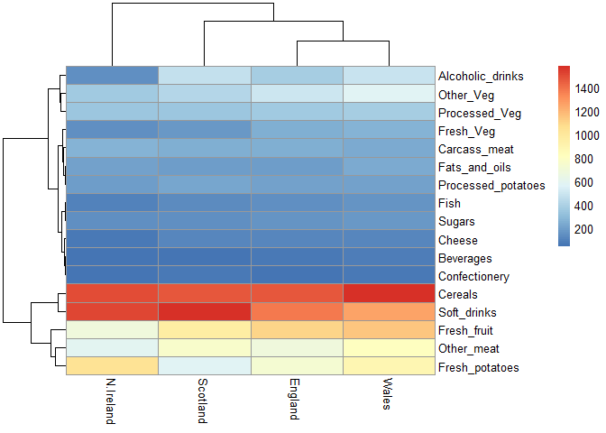

> Q6. Based on the pairs and heatmap figures, which countries cluster
> together and what does this suggest about their food consumption
> patterns? Can you easily tell what the main differences between N.
> Ireland and the other countries of the UK in terms of this data-set?

The countries that cluster together are England, Wales, and Scotland.
This means that they have very similar food consumption patterns across
the categories in the dataset. The main differences between Norther
Ireland and the other countries of the UK are that Northern Ireland has
a more distinct cluster in comparison to the other three which means
that its overall consumption differs systematically rather than by
random variation. Northern Ireland has a more consistent food
consumption pattern in comparison to the other countries and so this is
why they have a more distinct cluster.

## PCA to the rescue

The main PCA function in “base R” is called `prcomp()`. This function
wants the transpose of our food data as input (i.e. the foods as columns
and the countries as rows).

``` r
pca <- prcomp(t(x))
pca
```

    Standard deviations (1, .., p=4):
    [1] 3.241502e+02 2.127478e+02 7.387622e+01 3.175833e-14

    Rotation (n x k) = (17 x 4):
                                 PC1          PC2         PC3          PC4
    Cheese              -0.056955380  0.016012850  0.02394295 -0.694538519
    Carcass_meat         0.047927628  0.013915823  0.06367111  0.489884628
    Other_meat          -0.258916658 -0.015331138 -0.55384854  0.279023718
    Fish                -0.084414983 -0.050754947  0.03906481 -0.008483145
    Fats_and_oils       -0.005193623 -0.095388656 -0.12522257  0.076097502
    Sugars              -0.037620983 -0.043021699 -0.03605745  0.034101334
    Fresh_potatoes       0.401402060 -0.715017078 -0.20668248 -0.090972715
    Fresh_Veg           -0.151849942 -0.144900268  0.21382237 -0.039901917
    Other_Veg           -0.243593729 -0.225450923 -0.05332841  0.016719075
    Processed_potatoes  -0.026886233  0.042850761 -0.07364902  0.030125166
    Processed_Veg       -0.036488269 -0.045451802  0.05289191 -0.013969507
    Fresh_fruit         -0.632640898 -0.177740743  0.40012865  0.184072217
    Cereals             -0.047702858 -0.212599678 -0.35884921  0.191926714
    Beverages           -0.026187756 -0.030560542 -0.04135860  0.004831876
    Soft_drinks          0.232244140  0.555124311 -0.16942648  0.103508492
    Alcoholic_drinks    -0.463968168  0.113536523 -0.49858320 -0.316290619
    Confectionery       -0.029650201  0.005949921 -0.05232164  0.001847469

``` r
summary(pca)
```

    Importance of components:
                                PC1      PC2      PC3       PC4
    Standard deviation     324.1502 212.7478 73.87622 3.176e-14
    Proportion of Variance   0.6744   0.2905  0.03503 0.000e+00
    Cumulative Proportion    0.6744   0.9650  1.00000 1.000e+00

``` r
attributes(pca)
```

    $names
    [1] "sdev"     "rotation" "center"   "scale"    "x"       

    $class
    [1] "prcomp"

To make one of main PCA result figures we turn to `pca$x` the scores
along our new PCs. This is called “PC plot” or “score plot” or
“Ordination plot” …

``` r
pca$x
```

                     PC1         PC2        PC3           PC4
    England   -144.99315   -2.532999 105.768945 -4.894696e-14
    Wales     -240.52915 -224.646925 -56.475555  5.700024e-13
    Scotland   -91.86934  286.081786 -44.415495 -7.460785e-13
    N.Ireland  477.39164  -58.901862  -4.877895  2.321303e-13

``` r
my_cols <- c("orange", "red", "blue", "darkgreen")
my_cols
```

    [1] "orange"    "red"       "blue"      "darkgreen"

> Q7. Complete the code below to generate a plot of PC1 vs PC2. The
> second line adds text labels over the data points.

``` r
library (ggplot2)
```

    Warning: package 'ggplot2' was built under R version 4.4.3

``` r
# Create a data frame for plotting
df <- as.data.frame(pca$x)
df$Country <- rownames(df)

# Plot PC1 vs PC2 with ggplot
ggplot(pca$x)+
  aes(x = PC1, y = PC2, label = rownames(pca$x)) +
  geom_point(size = 3) +
  geom_text(vjust = -0.5) +
  xlim(-270, 500) +
  xlab("PC1") +
  ylab("PC2") +
  theme_bw()
```

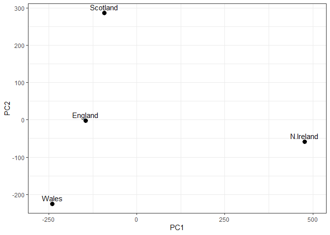

> Q8. Customize your plot so that the colors of the country names match
> the colors in our UK and Ireland map and table at the start of this
> document.

``` r
# Create a data frame for plotting
df <- as.data.frame(pca$x)
df$Country <- rownames(df)

# Plot PC1 vs PC2 with ggplot
ggplot(pca$x) +
  aes(x = PC1, y = PC2, label = rownames(pca$x)) +
  geom_point(size = 3, col = my_cols) +
  geom_text(vjust = -0.5) +
  xlim(-270, 500) +
  xlab("PC1") +
  ylab("PC2") +
  theme_bw()
```

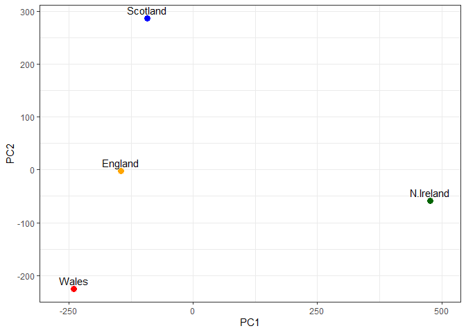

``` r
library (ggplot2)

ggplot (pca$x) +
  aes(PC1, PC2) +
  geom_point(col=my_cols)
```


The second major result figure is called a “loadings plot” of “variable
contributions plot” or “weight plot”

``` r
ggplot(pca$rotation) +
  aes(PC1, rownames(pca$rotation)) +
        geom_col()
```


> Q9. Generate a similar `loadings plot` for PC2. What two food groups
> feature predominately and what does PC2 mainly tell us about?

The two food groups that feature predominately are soft drinks (strong
positive loading) and fresh potatoes (negative loading). PC2 tells us
that diets with more soft drinks have high PC2 values while diets with
more fresh potatoes have low PC2 values. It is essentially comparing
processed/sugary beverages vs. more traditional staple foods.

``` r
ggplot(pca$rotation) +
  aes(PC2, rownames(pca$rotation)) +
        geom_col()
```

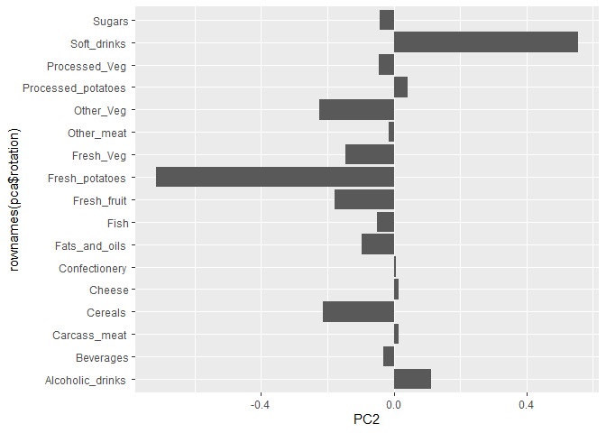
