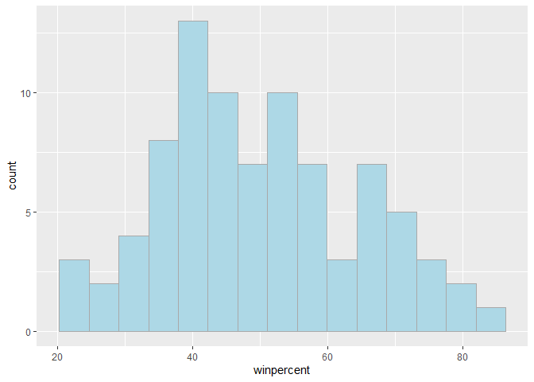
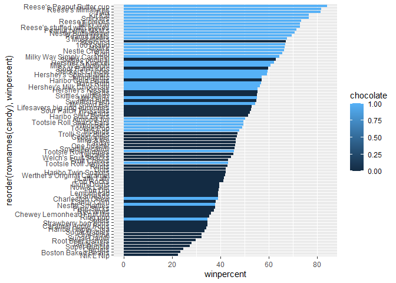
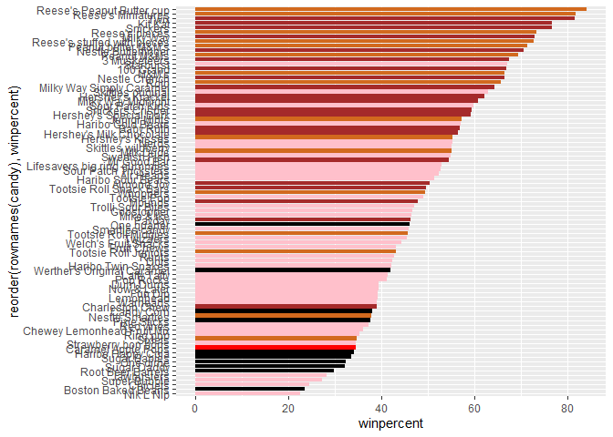
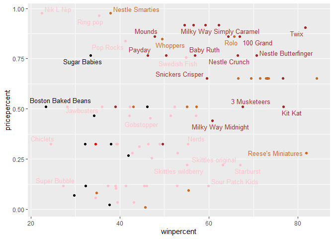
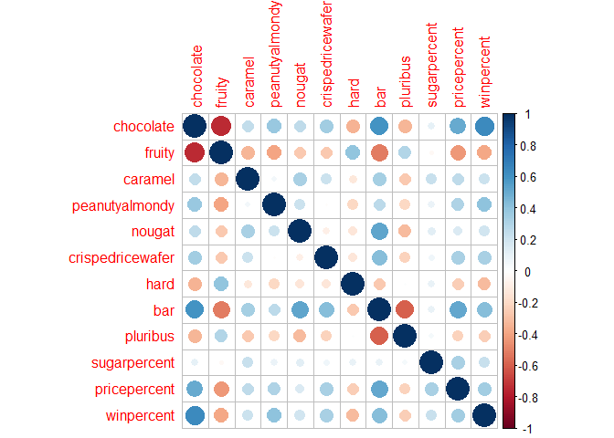
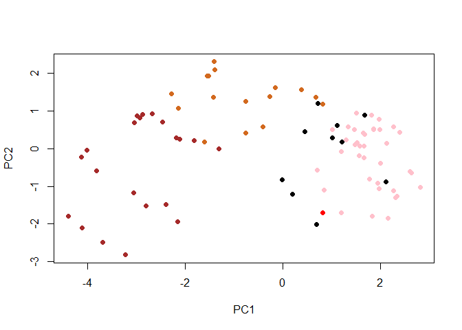
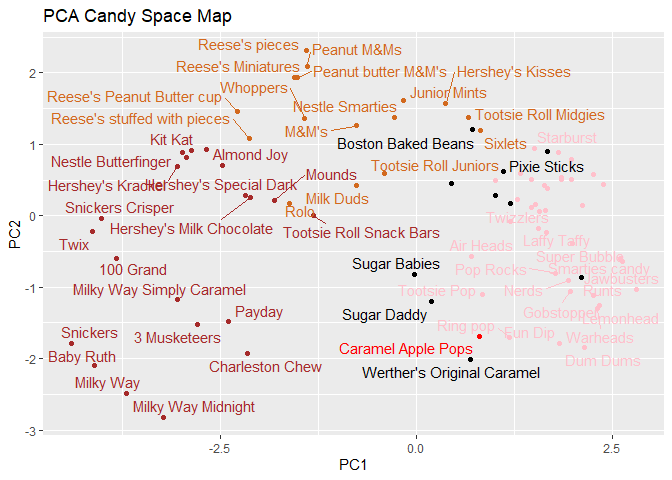

# Class09: Candy Mini-Project
Kenny Dang

- [Exploring the correlation
  structure](#exploring-the-correlation-structure)
- [Principal Component Analysis](#principal-component-analysis)
- [The loadings plot for PC1](#the-loadings-plot-for-pc1)

``` r
candy = read.csv("candy-data.csv", row.names= 1)

head(candy)
```

                 chocolate fruity caramel peanutyalmondy nougat crispedricewafer
    100 Grand            1      0       1              0      0                1
    3 Musketeers         1      0       0              0      1                0
    One dime             0      0       0              0      0                0
    One quarter          0      0       0              0      0                0
    Air Heads            0      1       0              0      0                0
    Almond Joy           1      0       0              1      0                0
                 hard bar pluribus sugarpercent pricepercent winpercent
    100 Grand       0   1        0        0.732        0.860   66.97173
    3 Musketeers    0   1        0        0.604        0.511   67.60294
    One dime        0   0        0        0.011        0.116   32.26109
    One quarter     0   0        0        0.011        0.511   46.11650
    Air Heads       0   0        0        0.906        0.511   52.34146
    Almond Joy      0   1        0        0.465        0.767   50.34755

> Q1. How many different candy types are in this dataset?

There are 85 different candy types in this dataset.

``` r
nrow(candy)
```

    [1] 85

There are 85 rows in this dataset.

> Q2. How many fruity candy types are in the dataset?

There are 38 fruit candy types in the dataset.

``` r
sum(candy$fruity)
```

    [1] 38

> Q3. what is your favorite candy (other than Twix) in the dataset and
> what is it’s `winpercent` value?

The winpercent value for my favorite candy (Warheads) is 39.0119.

``` r
candy["Warheads", ]$winpercent
```

    [1] 39.0119

> Q4. What is the `winpercent` value for “Kit Kat”?

The winpercent value for “Kit Kats” is 76.7686.

``` r
candy["Kit Kat", ]$winpercent
```

    [1] 76.7686

> Q5. What is the `winpercent` value for “Tootsie Roll Snack Bars”?

The winpercent value for “Tootsie Roll Snack Bars” is 49.6535.

``` r
candy["Tootsie Roll Snack Bars", ]$winpercent
```

    [1] 49.6535

``` r
library("skimr")
```

    Warning: package 'skimr' was built under R version 4.4.3

``` r
skim(candy)
```

|                                                  |       |
|:-------------------------------------------------|:------|
| Name                                             | candy |
| Number of rows                                   | 85    |
| Number of columns                                | 12    |
| \_\_\_\_\_\_\_\_\_\_\_\_\_\_\_\_\_\_\_\_\_\_\_   |       |
| Column type frequency:                           |       |
| numeric                                          | 12    |
| \_\_\_\_\_\_\_\_\_\_\_\_\_\_\_\_\_\_\_\_\_\_\_\_ |       |
| Group variables                                  | None  |

Data summary

**Variable type: numeric**

| skim_variable | n_missing | complete_rate | mean | sd | p0 | p25 | p50 | p75 | p100 | hist |
|:---|---:|---:|---:|---:|---:|---:|---:|---:|---:|:---|
| chocolate | 0 | 1 | 0.44 | 0.50 | 0.00 | 0.00 | 0.00 | 1.00 | 1.00 | ▇▁▁▁▆ |
| fruity | 0 | 1 | 0.45 | 0.50 | 0.00 | 0.00 | 0.00 | 1.00 | 1.00 | ▇▁▁▁▆ |
| caramel | 0 | 1 | 0.16 | 0.37 | 0.00 | 0.00 | 0.00 | 0.00 | 1.00 | ▇▁▁▁▂ |
| peanutyalmondy | 0 | 1 | 0.16 | 0.37 | 0.00 | 0.00 | 0.00 | 0.00 | 1.00 | ▇▁▁▁▂ |
| nougat | 0 | 1 | 0.08 | 0.28 | 0.00 | 0.00 | 0.00 | 0.00 | 1.00 | ▇▁▁▁▁ |
| crispedricewafer | 0 | 1 | 0.08 | 0.28 | 0.00 | 0.00 | 0.00 | 0.00 | 1.00 | ▇▁▁▁▁ |
| hard | 0 | 1 | 0.18 | 0.38 | 0.00 | 0.00 | 0.00 | 0.00 | 1.00 | ▇▁▁▁▂ |
| bar | 0 | 1 | 0.25 | 0.43 | 0.00 | 0.00 | 0.00 | 0.00 | 1.00 | ▇▁▁▁▂ |
| pluribus | 0 | 1 | 0.52 | 0.50 | 0.00 | 0.00 | 1.00 | 1.00 | 1.00 | ▇▁▁▁▇ |
| sugarpercent | 0 | 1 | 0.48 | 0.28 | 0.01 | 0.22 | 0.47 | 0.73 | 0.99 | ▇▇▇▇▆ |
| pricepercent | 0 | 1 | 0.47 | 0.29 | 0.01 | 0.26 | 0.47 | 0.65 | 0.98 | ▇▇▇▇▆ |
| winpercent | 0 | 1 | 50.32 | 14.71 | 22.45 | 39.14 | 47.83 | 59.86 | 84.18 | ▃▇▆▅▂ |

> Q6. Is there any variable/column that looks to be on a different scale
> to the majority of the other columns in the dataset?

winpercent is the variable that appears to be on a different scale as
the values appear to be between 0-100. All the other variables appear to
have values that are between 0-1.

``` r
summary(candy)
```

       chocolate          fruity          caramel       peanutyalmondy  
     Min.   :0.0000   Min.   :0.0000   Min.   :0.0000   Min.   :0.0000  
     1st Qu.:0.0000   1st Qu.:0.0000   1st Qu.:0.0000   1st Qu.:0.0000  
     Median :0.0000   Median :0.0000   Median :0.0000   Median :0.0000  
     Mean   :0.4353   Mean   :0.4471   Mean   :0.1647   Mean   :0.1647  
     3rd Qu.:1.0000   3rd Qu.:1.0000   3rd Qu.:0.0000   3rd Qu.:0.0000  
     Max.   :1.0000   Max.   :1.0000   Max.   :1.0000   Max.   :1.0000  
         nougat        crispedricewafer       hard             bar        
     Min.   :0.00000   Min.   :0.00000   Min.   :0.0000   Min.   :0.0000  
     1st Qu.:0.00000   1st Qu.:0.00000   1st Qu.:0.0000   1st Qu.:0.0000  
     Median :0.00000   Median :0.00000   Median :0.0000   Median :0.0000  
     Mean   :0.08235   Mean   :0.08235   Mean   :0.1765   Mean   :0.2471  
     3rd Qu.:0.00000   3rd Qu.:0.00000   3rd Qu.:0.0000   3rd Qu.:0.0000  
     Max.   :1.00000   Max.   :1.00000   Max.   :1.0000   Max.   :1.0000  
        pluribus       sugarpercent     pricepercent      winpercent   
     Min.   :0.0000   Min.   :0.0110   Min.   :0.0110   Min.   :22.45  
     1st Qu.:0.0000   1st Qu.:0.2200   1st Qu.:0.2550   1st Qu.:39.14  
     Median :1.0000   Median :0.4650   Median :0.4650   Median :47.83  
     Mean   :0.5176   Mean   :0.4786   Mean   :0.4689   Mean   :50.32  
     3rd Qu.:1.0000   3rd Qu.:0.7320   3rd Qu.:0.6510   3rd Qu.:59.86  
     Max.   :1.0000   Max.   :0.9880   Max.   :0.9760   Max.   :84.18  

> Q7. What do you think a zero and one represent for the
> “candy\$chocolate” column?

1 means the candy contains chocolate while 0 means the candy does not
contain chocolate.

``` r
candy$chocolate
```

     [1] 1 1 0 0 0 1 1 0 0 0 1 0 0 0 0 0 0 0 0 0 0 0 1 1 1 1 0 1 1 0 0 0 1 1 0 1 1 1
    [39] 1 1 1 0 1 1 0 0 0 1 0 0 0 1 1 1 1 0 1 0 0 1 0 0 1 0 1 1 0 0 0 0 0 0 0 0 1 1
    [77] 1 1 0 1 0 0 0 0 1

\##Explorartory Analysis

> Q8. Plot a histogram of winpercent values using both base R an
> ggplot2.

Plot is shown below.

``` r
library(ggplot2)
```

    Warning: package 'ggplot2' was built under R version 4.4.3

``` r
ggplot(candy) +
  aes(winpercent) +
  geom_histogram(bins=15, fill="lightblue", col="darkgray")
```



> Q9. Is the distribution of winpercent values symmetrical?

Since the mean is not equal to the median, this means that the
winpercent values are not symmetrical. And it can also be seen on the
graph in question 9 that the winpercent values are not symmetrical.

``` r
mean(candy$winpercent)
```

    [1] 50.31676

``` r
median(candy$winpercent)
```

    [1] 47.82975

The distribution is not symmetrical.

> Q10. Is the center of the distribution above or below 50%?

The center of distribution is below 50%.

``` r
mean(candy$winpercent)
```

    [1] 50.31676

``` r
median(candy$winpercent)
```

    [1] 47.82975

> Q11. On average is chocolate candy higher or lower ranked than fruit
> candy?

On average, chocolate candy is higher than the fruit candy.

Steps to solve this: 1. Find all chocolate candy in the dataset 2.
Extract or find their winpercent values 3. Calculate the mean of these
values

4.  Find all fruit candy
5.  Find their winpercent values
6.  Calculate their mean value

``` r
chocolate_candy <- candy[candy$chocolate == 1,]
chocolate_winpercent <- chocolate_candy$winpercent
mean_chocolate <- mean(chocolate_winpercent, na.rm = TRUE)
mean_chocolate
```

    [1] 60.92153

``` r
fruit_candy <- candy[candy$fruit == 1,]
fruit_winpercent <- fruit_candy$winpercent
mean_fruit <- mean(fruit_winpercent, na.rm = TRUE)
mean_fruit
```

    [1] 44.11974

> Q12. Is this difference statistically significant?

The difference is statistically significant as the p-value is
2.871\*10e-08 which is less than 0.05.

``` r
t.test(chocolate_winpercent, fruit_winpercent)
```


        Welch Two Sample t-test

    data:  chocolate_winpercent and fruit_winpercent
    t = 6.2582, df = 68.882, p-value = 2.871e-08
    alternative hypothesis: true difference in means is not equal to 0
    95 percent confidence interval:
     11.44563 22.15795
    sample estimates:
    mean of x mean of y 
     60.92153  44.11974 

> Q13. What are the five least liked candy types in this set?

The five least liked candy types in this dataset are Nik L Nip, Boston
Baked Beans, Chiclets, Super Bubble, and Jawbusters.

``` r
inds <- order(candy$winpercent)
candy[inds,][1:5,]
```

                       chocolate fruity caramel peanutyalmondy nougat
    Nik L Nip                  0      1       0              0      0
    Boston Baked Beans         0      0       0              1      0
    Chiclets                   0      1       0              0      0
    Super Bubble               0      1       0              0      0
    Jawbusters                 0      1       0              0      0
                       crispedricewafer hard bar pluribus sugarpercent pricepercent
    Nik L Nip                         0    0   0        1        0.197        0.976
    Boston Baked Beans                0    0   0        1        0.313        0.511
    Chiclets                          0    0   0        1        0.046        0.325
    Super Bubble                      0    0   0        0        0.162        0.116
    Jawbusters                        0    1   0        1        0.093        0.511
                       winpercent
    Nik L Nip            22.44534
    Boston Baked Beans   23.41782
    Chiclets             24.52499
    Super Bubble         27.30386
    Jawbusters           28.12744

> Q14. What are the top 5 all time favorite candy types out of this set?

The top 5 all time favorite candy types of this data set are: snickers,
kit kat, twix, reese’s minatures, reese’s peanut butter cup.

``` r
inds <- order(candy$winpercent, decreasing = TRUE)
candy[inds, ][1:5, ]
```

                              chocolate fruity caramel peanutyalmondy nougat
    Reese's Peanut Butter cup         1      0       0              1      0
    Reese's Miniatures                1      0       0              1      0
    Twix                              1      0       1              0      0
    Kit Kat                           1      0       0              0      0
    Snickers                          1      0       1              1      1
                              crispedricewafer hard bar pluribus sugarpercent
    Reese's Peanut Butter cup                0    0   0        0        0.720
    Reese's Miniatures                       0    0   0        0        0.034
    Twix                                     1    0   1        0        0.546
    Kit Kat                                  1    0   1        0        0.313
    Snickers                                 0    0   1        0        0.546
                              pricepercent winpercent
    Reese's Peanut Butter cup        0.651   84.18029
    Reese's Miniatures               0.279   81.86626
    Twix                             0.906   81.64291
    Kit Kat                          0.511   76.76860
    Snickers                         0.651   76.67378

> Q15. Make a first barplot of candy ranking based on winpercent values.

barplot shown below.

``` r
library (ggplot2)

ggplot(candy) +
  aes(winpercent, rownames(candy)) +
  geom_col()
```


> Q16. This is quite ugly, use the reorder() function to get the bars
> sorted by winpercent?

reorder() function used below.

``` r
ggplot(candy) +
  aes(winpercent,
      reorder(rownames(candy), winpercent),
      fill = chocolate) +
        geom_col()
```



\![Figure caption: my second barplot\] (barplot2.png)

I want custom colors that I pick so we need to make this ourselves…

``` r
my_cols <- rep("black", nrow(candy))
my_cols[as.logical(candy$chocolate)] = "chocolate"
my_cols[as.logical(candy$bar)] <- "brown"
my_cols[as.logical(candy$fruity)] <- "pink"
my_cols[10] <- "red"
my_cols
```

     [1] "brown"     "brown"     "black"     "black"     "pink"      "brown"    
     [7] "brown"     "black"     "black"     "red"       "brown"     "pink"     
    [13] "pink"      "pink"      "pink"      "pink"      "pink"      "pink"     
    [19] "pink"      "black"     "pink"      "pink"      "chocolate" "brown"    
    [25] "brown"     "brown"     "pink"      "chocolate" "brown"     "pink"     
    [31] "pink"      "pink"      "chocolate" "chocolate" "pink"      "chocolate"
    [37] "brown"     "brown"     "brown"     "brown"     "brown"     "pink"     
    [43] "brown"     "brown"     "pink"      "pink"      "brown"     "chocolate"
    [49] "black"     "pink"      "pink"      "chocolate" "chocolate" "chocolate"
    [55] "chocolate" "pink"      "chocolate" "black"     "pink"      "chocolate"
    [61] "pink"      "pink"      "chocolate" "pink"      "brown"     "brown"    
    [67] "pink"      "pink"      "pink"      "pink"      "black"     "black"    
    [73] "pink"      "pink"      "pink"      "chocolate" "chocolate" "brown"    
    [79] "pink"      "brown"     "pink"      "pink"      "pink"      "black"    
    [85] "chocolate"

my_cols \<- rep(“black”, nrow(candy))
my_cols\[candy$chocolate==1] <- "chocolate"
my_cols[candy$bar==1\] \<- “brown” my_cols\[candy\$fruity\] \<- “blue”
my_cols\[10\] \<- “red” my_cols

> Q17. What is the worst ranked chocolate candy?

The worst ranked chocolate candy is Sixlets.

``` r
ggplot(candy) +
  aes(winpercent, reorder(rownames(candy), winpercent)) +
  geom_col(fill= my_cols)
```



> Q18. What is the best ranked fruity candy?

The best ranked fruity candy is Starburst.

``` r
ggplot(candy) +
  aes(winpercent, reorder(rownames(candy), winpercent)) +
  geom_col(fill= my_cols)
```


> Q19. Which candy type is the highest ranked in terms of winpercent for
> the least money - i.e. offers the most bang for your buck?

Reese’s Miniatures, which is a chocolate candy, is the highest ranked in
terms of winpercent for the least money.

``` r
library(ggrepel)
```

    Warning: package 'ggrepel' was built under R version 4.4.3

``` r
# How about a plot of win vs price
ggplot(candy) +
  aes(x = winpercent, y=pricepercent, label=rownames(candy)) +
  geom_point(col=my_cols) + 
  geom_text_repel(col=my_cols, size=3.3, max.overlaps = 5)
```

    Warning: ggrepel: 54 unlabeled data points (too many overlaps). Consider
    increasing max.overlaps



> Q20. What are the top 5 most expensive candy types in the dataset and
> of these which is the least popular?

The top 5 most expensive candy types in the dataset are Nik L Nip,
Nestle Smarties, Ring pop, and Hershey’s Krackel, and Hershey’s Milk
Chocolate.

``` r
ord <- order(candy$pricepercent, decreasing = TRUE)
head( candy[ord,c(11,12)], n=5 )
```

                             pricepercent winpercent
    Nik L Nip                       0.976   22.44534
    Nestle Smarties                 0.976   37.88719
    Ring pop                        0.965   35.29076
    Hershey's Krackel               0.918   62.28448
    Hershey's Milk Chocolate        0.918   56.49050

## Exploring the correlation structure

Pearson correlation values range from -1 to +1

``` r
library (corrplot)
```

    Warning: package 'corrplot' was built under R version 4.4.3

    corrplot 0.95 loaded

``` r
cij <- cor(candy)
corrplot(cij)
```



> Q22. Examining this plot what two variables are anti-correlated
> (i.e. have minus values)

The two variables that are anti-correlated are chocolate and fruity as
their relationship is represented by a red circle (negative value).

``` r
library (corrplot)

cij <- cor(candy)
corrplot(cij)
```


> Q23. Similarly, what two variables are most positively correlated?

The two variables that are most positively correlated are chocolate and
winpercent as their relationship is represented by a blue circle
(positive value).

``` r
library (corrplot)

cij <- cor(candy)
corrplot(cij)
```


## Principal Component Analysis

``` r
pca <- prcomp(candy, scale=T)
summary (pca)
```

    Importance of components:
                              PC1    PC2    PC3     PC4    PC5     PC6     PC7
    Standard deviation     2.0788 1.1378 1.1092 1.07533 0.9518 0.81923 0.81530
    Proportion of Variance 0.3601 0.1079 0.1025 0.09636 0.0755 0.05593 0.05539
    Cumulative Proportion  0.3601 0.4680 0.5705 0.66688 0.7424 0.79830 0.85369
                               PC8     PC9    PC10    PC11    PC12
    Standard deviation     0.74530 0.67824 0.62349 0.43974 0.39760
    Proportion of Variance 0.04629 0.03833 0.03239 0.01611 0.01317
    Cumulative Proportion  0.89998 0.93832 0.97071 0.98683 1.00000

``` r
plot (pca$x[,1:2], col=my_cols, pch = 16)
```



The main results figure: the PCA score plot:

``` r
library (ggrepel)

ggplot(pca$x) +
  aes(PC1, PC2, label=rownames(pca$x)) +
  geom_point(col = my_cols) +
  geom_text_repel(col = my_cols) +
  labs (title = "PCA Candy Space Map")
```

    Warning: ggrepel: 27 unlabeled data points (too many overlaps). Consider
    increasing max.overlaps



> Q24. Complete the code to generate the loadings plot above. What
> original variables are picked up strongly by PC1 in the positive
> direction? Do these make sense to you? Where did you see this
> relationship highlighted previously?

The variables that are picked up strongly by PC1 in the positive
direction are “fruity”, “pluribus”, and “hard”. Yes, this makes sense.
This relationship was highlighted earlier when creating the correlation
structure which essentially depicted whether or not two variables had a
positive correlation or a negative correlation. This can also be seen on
the PCA scores plot as well.

## The loadings plot for PC1

``` r
ggplot(pca$rotation) +
aes(PC1, reorder(rownames(pca$rotation), PC1)) + 
geom_col()
```


> Q25. Based on your exploratory analysis, correlation findings, and PCA
> results, what combination of characteristics appears to make a
> “winning” candy? How do these different analyses (visualization,
> correlation, PCA) support or complement each other in reaching this
> conclusion?

The characteristics that appear to make a “winning” candy are that it
contains chocolate and it is a bar-style candy. The candy also being
priced on the lower end (pricepercent) makes it more popular among
consumers. These characteristics make a “winning” candy which beats
other types of candy such as fruity and hard candies. The scatterplot
comparing winpercent vs pricerpercent shows a cluster of chocolate bar
styel candies clustering towards the high end of the winpercent axis.
The correlation structure shows that the variables chocolate and bar
have a positive correlation and the variables chocolate and winpercent
have a positive correlation. The PCA bar plot also shows the strong
positive relationship between the variables chocolate, bar, and
winpercent.
