# Class 18: Pertussis Mini Project
Kenny Dang (PID: A18544481)

## Background

Pertussis (aka whoopingh cough) is a common lung infection caused by the
bacteria B. Pertussis.

This can infect all ages but is most severe for those under 1 year of
age.

The CDC track the number of [reported cases in
US](https://www.cdc.gov/pertussis/php/surveillance/pertussis-cases-by-year.html?CDC_AAref_Val=https://www.cdc.gov/pertussis/surv-reporting/cases-by-year.html)
We can “scrape” this data with the **datapasta** package.

``` r
cdc <- 
  data.frame(
                            year = c(1922,1923,1924,1925,1926,1927,
                                     1928,1929,1930,1931,1932,1933,1934,
                                     1935,1936,1937,1938,1939,1940,
                                     1941,1942,1943,1944,1945,1946,
                                     1947,1948,1949,1950,1951,1952,
                                     1953,1954,1955,1956,1957,1958,
                                     1959,1960,1961,1962,1963,1964,
                                     1965,1966,1967,1968,1969,1970,
                                     1971,1972,1973,1974,1975,1976,1977,
                                     1978,1979,1980,1981,1982,1983,
                                     1984,1985,1986,1987,1988,1989,
                                     1990,1991,1992,1993,1994,1995,
                                     1996,1997,1998,1999,2000,2001,
                                     2002,2003,2004,2005,2006,2007,
                                     2008,2009,2010,2011,2012,2013,
                                     2014,2015,2016,2017,2018,2019,2020,
                                     2021,2022,2023,2024,2025),
    cases = c(107473,164191,165418,152003,202210,181411,
                                     161799,197371,166914,172559,215343,
                                     179135,265269,180518,147237,214652,
                                     227319,103188,183866,222202,191383,191890,
                                     109873,133792,109860,156517,74715,
                                     69479,120718,68687,45030,37129,60886,
                                     62786,31732,28295,32148,40005,14809,
                                     11468,17749,17135,13005,6799,7717,9718,
                                     4810,3285,4249,3036,3287,1759,2402,
                                     1738,1010,2177,2063,1623,1730,1248,
                                     1895,2463,2276,3589,4195,2823,3450,4157,
                                     4570,2719,4083,6586,4617,5137,7796,
                                     6564,7405,7298,7867,7580,9771,11647,
                                     25827,25616,15632,10454,13278,16858,
                                     27550,18719,48277,28639,32971,20762,
                                     17972,18975,15609,18617,6124,2116,3044,
                                     7063,22538, 21996)
  )
```

> Q1. Make a plot of `year` vs. `cases`. With the help of the R “addin”
> package datapasta assign the CDC pertussis case number data to a data
> fram called cdc and use ggplot to make a plot of cases numbers over
> time.

``` r
library (ggplot2)
```

    Warning: package 'ggplot2' was built under R version 4.4.3

``` r
ggplot (cdc) + 
  aes(year, cases) + 
  geom_point() +
  geom_line() +
  labs (title = "Pertussis Cases by Year (1922-2025)", x = "Year", y = "Number of cases")
```

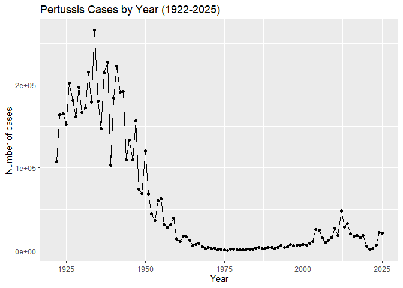

> Q. Add some major milestones including the first wP vaccine roll-out
> (1946), the switch to the new aP vaccine (1996), the COVID years
> (2020)

> Q2. Using the ggplot geom_vline() function add lines to your previous
> plot for the 1946 introduction of the wP vaccine and the 1996 switch
> to aP vaccine (see example in the hint below). What do you notice?

Before the introduction of the wP vaccine, pertussis cases were very
high (usually greater than 100,000 per year). After the introduction and
use of the wP vaccine, pertussis cases dropped dramatically to very low
levels. But after the introduction and switch to the aP vaccine,
pertussis cases started increasing slowly again but it is still lower
than pre-vaccine levels.

``` r
library (ggplot2)

ggplot (cdc) + 
  aes(year, cases) + 
  geom_point() + 
  geom_line() +
  labs (title = "Pertussis Cases by Year (1922-2025)", x = "Year", y = "Number of cases") +
geom_vline(xintercept = 1946, col = "blue", lty=2) +
   geom_vline(xintercept = 1996, col = "red", lty=2) +
 geom_vline(xintercept = 2020, col = "gray", lty=2) +
annotate("text", x = 1946, y = max(cdc$cases), label = "wP", color = "blue") +
annotate("text", x = 1996, y = max(cdc$cases), label = "aP", color = "red")
```

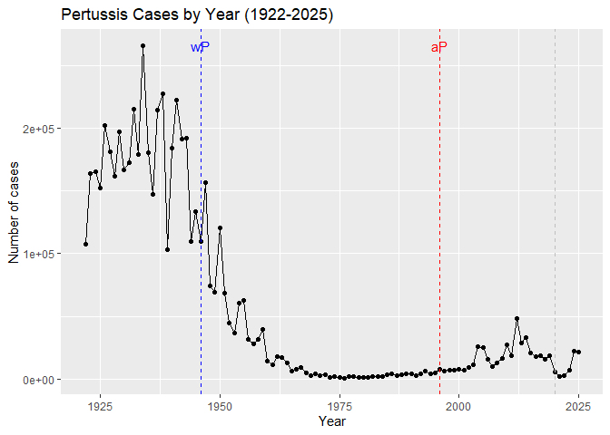

## for cases

22538 for year 2024 21996 for year 2025

> Q3. Describe what happened after the introduction of the aP vaccine?
> Do you have a possible explanation for the observed trend?

After the introduction of the aP vaccine, pertussis cases started
increasing slightly. A possible explanation for this observed trend is
that the aP vaccine provides weaker/shorter-lasting immunity compared to
the wP vaccine. Due to the immunity fading over time, more people become
as risk for infection which is why there is a rise in pertussis cases
after 1996. Also people being more hesitant in regards to vaccinations
could be a possible reason as to why there is a slow rise in pertussis
cases.

## There were high case numbers in the pre 1940s. Booster shot helps with decreasing the number of vaccine. wP better than aP vaccine.

**Why is this vaccine-preventable disease on the upswing?** To answer
this question we need to investigate the mechanisms underlying waning
protection against pertussis. This requires evaluation of
pertussis-specific immune responses over time in wP and aP vaccinated
individuals.

\#CMI PB project [Computational Models of
Immunity](https://www.cmi-pb.org/) – Pertussis Boost project aims to
provide the scientific community with this very information.

They make their data avilable via JSON format returning API. We can read
this in R with the `read_json()` function from the **jsonlite** package:

``` r
library(jsonlite)
```

    Warning: package 'jsonlite' was built under R version 4.4.3

``` r
subject <- read_json("http://cmi-pb.org/api/v5_1/subject", simplifyVector = TRUE)

head(subject)
```

      subject_id infancy_vac biological_sex              ethnicity  race
    1          1          wP         Female Not Hispanic or Latino White
    2          2          wP         Female Not Hispanic or Latino White
    3          3          wP         Female                Unknown White
    4          4          wP           Male Not Hispanic or Latino Asian
    5          5          wP           Male Not Hispanic or Latino Asian
    6          6          wP         Female Not Hispanic or Latino White
      year_of_birth date_of_boost      dataset
    1    1986-01-01    2016-09-12 2020_dataset
    2    1968-01-01    2019-01-28 2020_dataset
    3    1983-01-01    2016-10-10 2020_dataset
    4    1988-01-01    2016-08-29 2020_dataset
    5    1991-01-01    2016-08-29 2020_dataset
    6    1988-01-01    2016-10-10 2020_dataset

> Q4. How many aP and wP infancy vaccinated subjects are in the dataset?

There are 87 aP infancy vaccinated subjects in the dataset. There are 85
wP infancy vaccinated subjects in the dataset.

``` r
table(subject$infancy_vac)
```


    aP wP 
    87 85 

> Q5. How many Male and Female subjects/patients are in the dataset?

There are 60 male patients in the dataset. There are 112 female patients
in the dataset.

``` r
table(subject$biological_sex)
```


    Female   Male 
       112     60 

> Q6. What is the breakdown of race and biological sex (e.g. number of
> Asian females, White males etc…)?

In regards to American Indian/Alaska Native: 0 females and 1 male. In
regards to Asians: 32 females and 12 males. In regards to Black or
African American: 2 females and 3 males. In regards to more than one
race: 15 females and 4 males. In regards to native Hawaiian or other
pacific islander: 1 female and 1 male. In regards to unknown or not
reported: 14 females and 7 males. In regards to white: 48 females and 32
males.

``` r
table(subject$race, subject$biological_sex)
```

                                               
                                                Female Male
      American Indian/Alaska Native                  0    1
      Asian                                         32   12
      Black or African American                      2    3
      More Than One Race                            15    4
      Native Hawaiian or Other Pacific Islander      1    1
      Unknown or Not Reported                       14    7
      White                                         48   32

> Q. In terms of race and gender, is this dataset representative of the
> US population?

``` r
table(subject$race, subject$biological_sex)
```

                                               
                                                Female Male
      American Indian/Alaska Native                  0    1
      Asian                                         32   12
      Black or African American                      2    3
      More Than One Race                            15    4
      Native Hawaiian or Other Pacific Islander      1    1
      Unknown or Not Reported                       14    7
      White                                         48   32

> Q7. Using this approach determine (i) the average age of wP
> individuals, (ii) the average age of aP individuals; and (iii) are
> they significantly different?

The average age of wP individuals is 28. The average age of aP
individuals is 37. They are significantly different since the
individuals who got the wP vaccine are generally older and the
difference between the mean ages of the two groups is about 9 years
which is a large difference.

``` r
library (lubridate)
```

    Warning: package 'lubridate' was built under R version 4.4.3


    Attaching package: 'lubridate'

    The following objects are masked from 'package:base':

        date, intersect, setdiff, union

``` r
subject$age <- today() - ymd(subject$year_of_birth)
subject$age
```

    Time differences in days
      [1] 14681 21256 15777 13951 12855 13951 16507 15046 11029 16142 14681 16142
     [13] 10663 12124 13585 14316 16873 10663 11759 16507 15777 15046 12855 12490
     [25] 13951 15777 10663 16142 10663 13951 13585 10663 13220 15777 12855 10663
     [37] 10298 10663 15046 11759 15046 10663 10298 10298 10663 10298 11029 10298
     [49] 10663 10663 10663 10298 10298 10663 10663 10663 11029 10663 10663 10663
     [61] 14316 12124 11394 12124 13220 18334 19795 19795 13220 10298 10298 12855
     [73] 11394 11394 10298 10298 13951 12124 14316 12490 12124 10298  9933 10663
     [85]  9568 10298  9568  9568 10663  9933 10298  9568 11029  9933 10298  9568
     [97] 14681 12124  9933  9202  8472  8472 11759 13585 11759 11029 10298 11394
    [109] 13585 10663 11029 11029 11029 13220  8837  9568 11759 10298 10298 11394
    [121]  9568  9933 11029  9568 12124 12124 11029 11759 12855 11029 10298 11394
    [133] 10663 13220 11394 11394 10298  9568 12124  9202 11029 12855  8472  9933
    [145]  8837 12490  9568 13951 12855 12855 12490 11394 10298 10663 10663  9202
    [157] 10663  9568 11759 11029 12124  9933 12124 12855 12124  9202 10663 12855
    [169]  8472 12490  8472 14681

``` r
library(dplyr)
```

    Warning: package 'dplyr' was built under R version 4.4.3


    Attaching package: 'dplyr'

    The following objects are masked from 'package:stats':

        filter, lag

    The following objects are masked from 'package:base':

        intersect, setdiff, setequal, union

``` r
ap <- subject %>% filter(infancy_vac == "aP")

round( summary( time_length( ap$age, "years" ) ) )
```

       Min. 1st Qu.  Median    Mean 3rd Qu.    Max. 
         23      27      28      28      29      35 

``` r
# wP
wp <- subject %>% filter(infancy_vac == "wP")
round( summary( time_length( wp$age, "years" ) ) )
```

       Min. 1st Qu.  Median    Mean 3rd Qu.    Max. 
         23      33      35      37      40      58 

> Q8. Determine the age of all individuals at time of boost?

The average age of all individuals at time of boost is 26.

``` r
int <- ymd(subject$date_of_boost) - ymd(subject$year_of_birth)
age_at_boost <- time_length(int, "year")
head(age_at_boost)
```

    [1] 30.69678 51.07461 33.77413 28.65982 25.65914 28.77481

``` r
age_at_boost
```

      [1] 30.69678 51.07461 33.77413 28.65982 25.65914 28.77481 35.84942 34.14921
      [9] 20.56400 34.56263 30.65845 34.56263 19.56194 23.61944 27.61944 29.56331
     [17] 36.69815 19.65777 22.73511 35.65777 33.65914 31.65777 25.73580 24.70089
     [25] 28.70089 33.73580 19.73443 34.73511 19.73443 28.73648 27.73443 19.81109
     [33] 26.77344 33.81246 25.77413 19.81109 18.85010 19.81109 31.81109 22.81177
     [41] 31.84942 19.84942 18.85010 18.85010 19.90691 18.85010 20.90897 19.04449
     [49] 20.04381 19.90691 19.90691 19.00616 19.00616 20.04381 20.04381 20.07940
     [57] 21.08145 20.07940 20.07940 20.07940 32.26557 25.90007 23.90144 25.90007
     [65] 28.91992 42.92129 47.07461 47.07461 29.07324 21.07324 21.07324 28.15058
     [73] 24.15058 24.15058 21.14990 21.14990 31.20876 26.20671 32.20808 27.20876
     [81] 26.20671 21.20739 20.26557 22.26420 19.32375 21.32238 19.32375 19.32375
     [89] 22.41752 20.41889 21.41821 19.47707 23.47707 20.47639 21.47570 19.47707
     [97] 35.90965 28.73648 22.68309 20.83231 18.83368 18.83368 27.68241 32.68172
    [105] 27.68241 25.68378 23.68241 26.73785 32.73648 24.73648 25.79603 25.79603
    [113] 25.79603 31.79466 19.83299 21.91102 27.90965 24.06297 23.90965 27.12115
    [121] 22.12183 23.12115 26.17933 22.17933 29.17728 29.23477 26.23682 28.29295
    [129] 31.29363 26.29432 24.35044 27.35113 25.40999 32.41068 27.56194 27.41136
    [137] 24.50650 22.56263 29.56057 21.69473 26.69678 31.90691 19.90691 23.90691
    [145] 20.90623 31.00616 23.00616 35.00616 32.00548 32.00548 31.04449 28.12047
    [153] 25.11978 26.11910 26.19302 22.19302 26.19302 23.19507 29.19370 27.32923
    [161] 30.32717 24.55852 30.55715 32.55852 30.55715 22.67488 26.67488 32.67625
    [169] 20.67625 31.75086 20.86516 36.06297

``` r
summary(age_at_boost)
```

       Min. 1st Qu.  Median    Mean 3rd Qu.    Max. 
      18.83   21.03   25.75   26.09   29.56   51.07 

> Q9. With the help of a faceted boxplot or histogram (see below), do
> you think these two groups are significantly different?

Based on the histograms below, yes the two groups are significantly
different. This conclusion is further supported due to the p-value test
as the calculated p-value is 2.37e-23 which is less than 0.05 which
means that the difference is statistically significant. Individuals who
got the aP vaccine are generally younger while individuals who got the
wP vaccine are generally older.

``` r
ggplot(subject) +
  aes(time_length(age, "year"),
      fill=as.factor(infancy_vac)) +
  geom_histogram(show.legend=FALSE) +
  facet_wrap(vars(infancy_vac), nrow=2) +
  xlab("Age in years")
```

    `stat_bin()` using `bins = 30`. Pick better value `binwidth`.

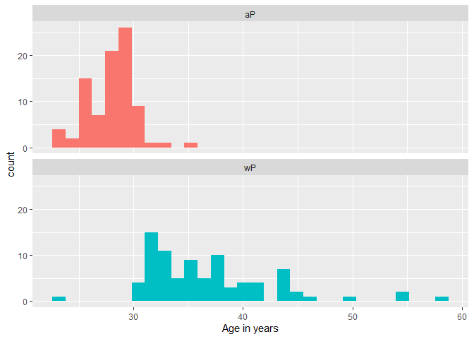

``` r
# Or use wilcox.test() 
x <- t.test(time_length( wp$age, "years" ),
       time_length( ap$age, "years" ))

x$p.value
```

    [1] 2.372101e-23

## Joining multiple tables

Let’s read some more database tables:

``` r
specimen <- read_json("http://cmi-pb.org/api/v5_1/specimen", simplifyVector = TRUE)

ab_titer <- read_json("http://cmi-pb.org/api/v5_1/plasma_ab_titer", simplifyVector = TRUE)
```

``` r
head(specimen)
```

      specimen_id subject_id actual_day_relative_to_boost
    1           1          1                           -3
    2           2          1                            1
    3           3          1                            3
    4           4          1                            7
    5           5          1                           11
    6           6          1                           32
      planned_day_relative_to_boost specimen_type visit
    1                             0         Blood     1
    2                             1         Blood     2
    3                             3         Blood     3
    4                             7         Blood     4
    5                            14         Blood     5
    6                            30         Blood     6

``` r
head(ab_titer)
```

      specimen_id isotype is_antigen_specific antigen        MFI MFI_normalised
    1           1     IgE               FALSE   Total 1110.21154       2.493425
    2           1     IgE               FALSE   Total 2708.91616       2.493425
    3           1     IgG                TRUE      PT   68.56614       3.736992
    4           1     IgG                TRUE     PRN  332.12718       2.602350
    5           1     IgG                TRUE     FHA 1887.12263      34.050956
    6           1     IgE                TRUE     ACT    0.10000       1.000000
       unit lower_limit_of_detection
    1 UG/ML                 2.096133
    2 IU/ML                29.170000
    3 IU/ML                 0.530000
    4 IU/ML                 6.205949
    5 IU/ML                 4.679535
    6 IU/ML                 2.816431

To analyze this data we need to first “join” (merge/link) the different
tables so we have all the data in one place not spread across different
tables.

We can use the `*_join()` family of functions from **dplyr** to do this

> Q9. Complete the code to join specimen and subject tables to make a
> new merged data frame containing all specimen records along with their
> associated subject details:

Completed

``` r
library (dplyr)

meta <- left_join(specimen, subject, by = "subject_id") 
dim(meta)
```

    [1] 1503   14

``` r
head(meta)
```

      specimen_id subject_id actual_day_relative_to_boost
    1           1          1                           -3
    2           2          1                            1
    3           3          1                            3
    4           4          1                            7
    5           5          1                           11
    6           6          1                           32
      planned_day_relative_to_boost specimen_type visit infancy_vac biological_sex
    1                             0         Blood     1          wP         Female
    2                             1         Blood     2          wP         Female
    3                             3         Blood     3          wP         Female
    4                             7         Blood     4          wP         Female
    5                            14         Blood     5          wP         Female
    6                            30         Blood     6          wP         Female
                   ethnicity  race year_of_birth date_of_boost      dataset
    1 Not Hispanic or Latino White    1986-01-01    2016-09-12 2020_dataset
    2 Not Hispanic or Latino White    1986-01-01    2016-09-12 2020_dataset
    3 Not Hispanic or Latino White    1986-01-01    2016-09-12 2020_dataset
    4 Not Hispanic or Latino White    1986-01-01    2016-09-12 2020_dataset
    5 Not Hispanic or Latino White    1986-01-01    2016-09-12 2020_dataset
    6 Not Hispanic or Latino White    1986-01-01    2016-09-12 2020_dataset
             age
    1 14681 days
    2 14681 days
    3 14681 days
    4 14681 days
    5 14681 days
    6 14681 days

> Q10. Now using the same procedure join meta with titer data so we can
> further analyze this data in terms of time of visit aP/wP, male/female
> etc.

Completed

``` r
library (dplyr)

abdata <- inner_join(ab_titer, meta)
```

    Joining with `by = join_by(specimen_id)`

``` r
dim(abdata)
```

    [1] 61956    21

``` r
head(abdata)
```

      specimen_id isotype is_antigen_specific antigen        MFI MFI_normalised
    1           1     IgE               FALSE   Total 1110.21154       2.493425
    2           1     IgE               FALSE   Total 2708.91616       2.493425
    3           1     IgG                TRUE      PT   68.56614       3.736992
    4           1     IgG                TRUE     PRN  332.12718       2.602350
    5           1     IgG                TRUE     FHA 1887.12263      34.050956
    6           1     IgE                TRUE     ACT    0.10000       1.000000
       unit lower_limit_of_detection subject_id actual_day_relative_to_boost
    1 UG/ML                 2.096133          1                           -3
    2 IU/ML                29.170000          1                           -3
    3 IU/ML                 0.530000          1                           -3
    4 IU/ML                 6.205949          1                           -3
    5 IU/ML                 4.679535          1                           -3
    6 IU/ML                 2.816431          1                           -3
      planned_day_relative_to_boost specimen_type visit infancy_vac biological_sex
    1                             0         Blood     1          wP         Female
    2                             0         Blood     1          wP         Female
    3                             0         Blood     1          wP         Female
    4                             0         Blood     1          wP         Female
    5                             0         Blood     1          wP         Female
    6                             0         Blood     1          wP         Female
                   ethnicity  race year_of_birth date_of_boost      dataset
    1 Not Hispanic or Latino White    1986-01-01    2016-09-12 2020_dataset
    2 Not Hispanic or Latino White    1986-01-01    2016-09-12 2020_dataset
    3 Not Hispanic or Latino White    1986-01-01    2016-09-12 2020_dataset
    4 Not Hispanic or Latino White    1986-01-01    2016-09-12 2020_dataset
    5 Not Hispanic or Latino White    1986-01-01    2016-09-12 2020_dataset
    6 Not Hispanic or Latino White    1986-01-01    2016-09-12 2020_dataset
             age
    1 14681 days
    2 14681 days
    3 14681 days
    4 14681 days
    5 14681 days
    6 14681 days

> Q11. How many specimens (i.e. entries in abdata) do we have for each
> isotype?

There are 6698 specimens for the IgE isotype. There are 7265 specimens
for the IgG isotype. There are 11993 specimens for the IgG1 isotype.
There are 12000 specimens for the IgG2 isotype. There are 12000
specimens for the IgG3 isotype. There are 12000 specimens for the IgG4
isotype.

``` r
table(abdata$isotype)
```


      IgE   IgG  IgG1  IgG2  IgG3  IgG4 
     6698  7265 11993 12000 12000 12000 

> Q. What antigens are reported?

``` r
table(abdata$antigen)
```


        ACT   BETV1      DT   FELD1     FHA  FIM2/3   LOLP1     LOS Measles     OVA 
       1970    1970    6318    1970    6712    6318    1970    1970    1970    6318 
        PD1     PRN      PT     PTM   Total      TT 
       1970    6712    6712    1970     788    6318 

> Q12. What are the different \$dataset values in abdata and what do you
> notice about the number of rows for the most “recent” dataset?

There are four different datasets which includes 2020, 2021, 2022, and
2023. The most recent dataset has the second most rows. This could be
due to the scientists having more samples to process and there is more
cases to analyze compared to the last two datasets.

``` r
unique(abdata$dataset)
```

    [1] "2020_dataset" "2021_dataset" "2022_dataset" "2023_dataset"

``` r
table(abdata$dataset)
```


    2020_dataset 2021_dataset 2022_dataset 2023_dataset 
           31520         8085         7301        15050 

## Examine IgG Ab titer levels

Let’s focus on the IgG antigen and make a plot of MFI_normalized for all
antigens.

``` r
igg <- abdata |>
  filter(isotype == "IgG")

head(igg)
```

      specimen_id isotype is_antigen_specific antigen        MFI MFI_normalised
    1           1     IgG                TRUE      PT   68.56614       3.736992
    2           1     IgG                TRUE     PRN  332.12718       2.602350
    3           1     IgG                TRUE     FHA 1887.12263      34.050956
    4          19     IgG                TRUE      PT   20.11607       1.096366
    5          19     IgG                TRUE     PRN  976.67419       7.652635
    6          19     IgG                TRUE     FHA   60.76626       1.096457
       unit lower_limit_of_detection subject_id actual_day_relative_to_boost
    1 IU/ML                 0.530000          1                           -3
    2 IU/ML                 6.205949          1                           -3
    3 IU/ML                 4.679535          1                           -3
    4 IU/ML                 0.530000          3                           -3
    5 IU/ML                 6.205949          3                           -3
    6 IU/ML                 4.679535          3                           -3
      planned_day_relative_to_boost specimen_type visit infancy_vac biological_sex
    1                             0         Blood     1          wP         Female
    2                             0         Blood     1          wP         Female
    3                             0         Blood     1          wP         Female
    4                             0         Blood     1          wP         Female
    5                             0         Blood     1          wP         Female
    6                             0         Blood     1          wP         Female
                   ethnicity  race year_of_birth date_of_boost      dataset
    1 Not Hispanic or Latino White    1986-01-01    2016-09-12 2020_dataset
    2 Not Hispanic or Latino White    1986-01-01    2016-09-12 2020_dataset
    3 Not Hispanic or Latino White    1986-01-01    2016-09-12 2020_dataset
    4                Unknown White    1983-01-01    2016-10-10 2020_dataset
    5                Unknown White    1983-01-01    2016-10-10 2020_dataset
    6                Unknown White    1983-01-01    2016-10-10 2020_dataset
             age
    1 14681 days
    2 14681 days
    3 14681 days
    4 15777 days
    5 15777 days
    6 15777 days

> Q13. Complete the following code to make a summary boxplot of Ab titer
> levels (MFI) for all antigens:

``` r
ggplot(igg) +
  aes(MFI_normalised, antigen) +
  geom_boxplot() +
  xlim(0,75) +
  facet_wrap(vars(visit), nrow=2)
```

    Warning: Removed 5 rows containing non-finite outside the scale range
    (`stat_boxplot()`).

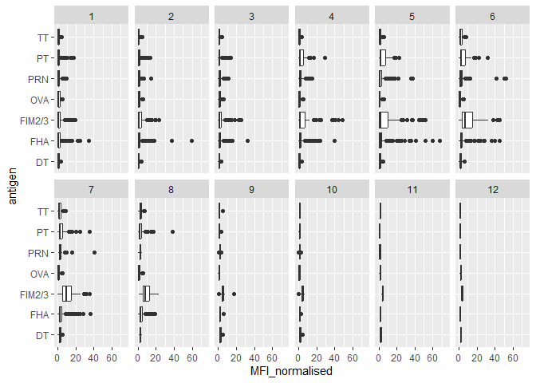

> Q. Is there a difference for aP vs wP individuals with these values?

Yes there is a difference between the aP and wP individuals.

``` r
ggplot(igg) +
  aes(MFI_normalised, antigen, col=infancy_vac) +
  geom_boxplot()
```


> Q14. What antigens show differences in the level of IgG antibody
> titers recognizing them over time? Why these and not others?

The antigens FHA, FIM2/3, PT, and PRN show a large differences in the
level of IgG antibody titers recognizing them over time. The levels
increase around the time of boost and then they decrease later. These
antigens are what makes up of the pertussis vaccine so antibody levels
change in response to vaccination. Meanwhile, DT, TT, and OVA show
little change over time and this could be due to either unrelated
control antigens or represent immunity from prior vaccinations that
stays relatively stable.

> Q. Is there a temprol response - i.e do values increase or decrease
> over time?

``` r
ggplot(igg) +
  aes(MFI_normalised, antigen, col=infancy_vac) +
  geom_boxplot(show.legend = FALSE) +
  facet_wrap(vars(visit), nrow=2) +
  xlim(0,75) +
  theme_bw()
```

    Warning: Removed 5 rows containing non-finite outside the scale range
    (`stat_boxplot()`).

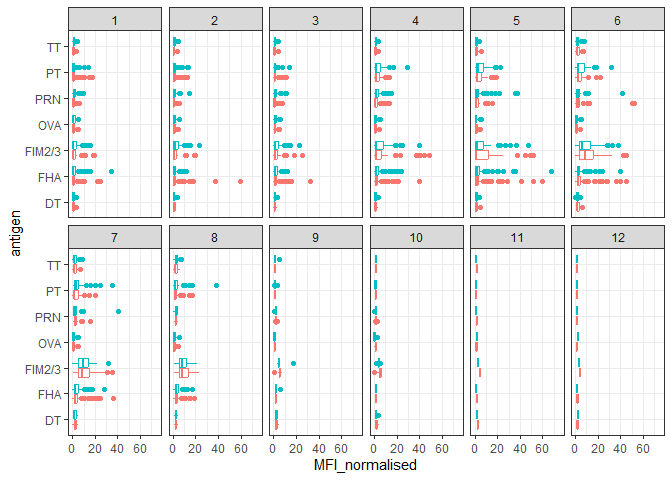

``` r
igg %>% filter(visit != 8) %>%
ggplot() +
  aes(MFI_normalised, antigen, col=infancy_vac ) +
  geom_boxplot(show.legend = FALSE) + 
  xlim(0,75) +
  facet_wrap(vars(infancy_vac, visit), nrow=2) +
  theme(axis.text.x = element_text(angle = 45, hjust=1))
```

    Warning: Removed 5 rows containing non-finite outside the scale range
    (`stat_boxplot()`).

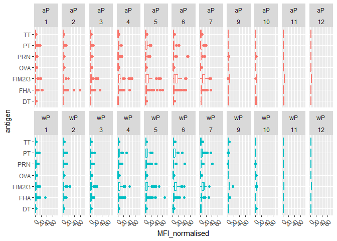

> Q15. Filter to pull out only two specific antigens for analysis and
> create a boxplot for each. You can chose any you like. Below I picked
> a “control” antigen (“OVA”, that is not in our vaccines) and a clear
> antigen of interest (“PT”, Pertussis Toxin, one of the key virulence
> factors produced by the bacterium B. pertussis).

``` r
filter(igg, antigen=="OVA") %>%
  ggplot() +
  aes(MFI_normalised, col=infancy_vac) +
  geom_boxplot(show.legend = FALSE) +
  facet_wrap(vars(visit)) +
  theme_bw()
```

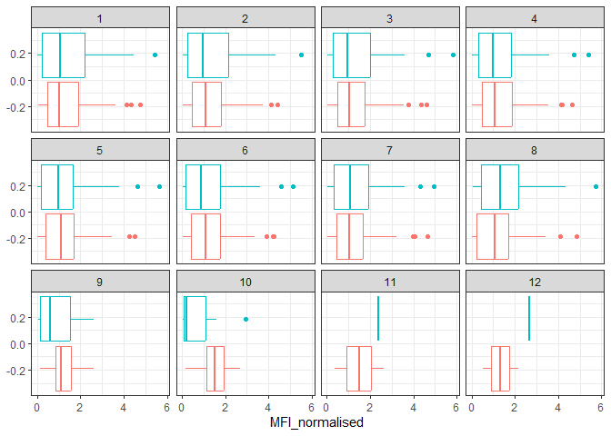

``` r
filter(igg, antigen=="FIM2/3") %>%
  ggplot() +
  aes(MFI_normalised, col=infancy_vac) +
  geom_boxplot(show.legend = FALSE) +
  facet_wrap(vars(visit)) +
  theme_bw()
```

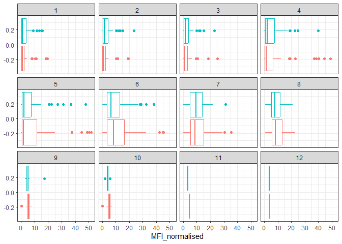

> Q16. What do you notice about these two antigens time courses and the
> PT data in particular?

The PT levels increase over time and it is higher than FIM2/3. It also
looks to reach its peak at visit 7 and then it starts decreasing. This
trend is similar for wP and aP subjects. The PT antigen shows a dramatic
increase in IgG antibody levels after vaccination, especially around
visits 4-6. Meanwhile, the FIM2/3 antigen shows lower antibody levels
and a more slow change over time. This means that the immune response is
specific to pertussis antigens like PT and not to unrelated antigens
like FIM2/3.

> Q17. Do you see any clear difference in aP vs. wP responses?

Yes, there is a clear difference between aP and wP responses. In many of
the visits, individuals who got the wP vaccine show higher IgG antibody
levels compared to those who got the aP vaccines. This means that the
whole-cell pertussis vaccine may produce a stronger or longer-lasting
immune response compared to the acellular pertussis vaccine. The
distributions for wP are more towards the right side of the graph
compared to aP.

## Focus on “PT” Pertusisis Toxin antigen

``` r
pt.igg.21 <- igg |> filter (antigen == "PT",
                       dataset  == "2021_dataset")
pt.igg.21
```

        specimen_id isotype is_antigen_specific antigen         MFI MFI_normalised
    1           468     IgG               FALSE      PT  112.750000     1.00000000
    2           469     IgG               FALSE      PT  111.250000     0.98669623
    3           470     IgG               FALSE      PT  125.500000     1.11308204
    4           471     IgG               FALSE      PT  224.250000     1.98891353
    5           472     IgG               FALSE      PT  304.000000     2.69623060
    6           473     IgG               FALSE      PT  274.000000     2.43015521
    7           474     IgG               FALSE      PT  171.750000     1.52328160
    8           475     IgG               FALSE      PT  124.951277     1.10821532
    9           476     IgG               FALSE      PT  275.201277     2.44080956
    10          477     IgG               FALSE      PT  263.201277     2.33437940
    11          478     IgG               FALSE      PT  852.201277     7.55832619
    12          479     IgG               FALSE      PT 1548.451277    13.73349248
    13          480     IgG               FALSE      PT 1194.451277    10.59380290
    14          481     IgG               FALSE      PT  679.951277     6.03061000
    15          483     IgG               FALSE      PT  278.701277     2.47185168
    16          484     IgG               FALSE      PT  441.451277     3.91531066
    17          485     IgG               FALSE      PT  498.451277     4.42085390
    18          486     IgG               FALSE      PT 1526.951277    13.54280512
    19          487     IgG               FALSE      PT 1916.701277    16.99956787
    20          488     IgG               FALSE      PT 1150.701277    10.20577630
    21          489     IgG               FALSE      PT  748.951277     6.64258339
    22          490     IgG               FALSE      PT  353.201277     3.13260556
    23          491     IgG               FALSE      PT  506.701277     4.49402463
    24          492     IgG               FALSE      PT  476.701277     4.22794925
    25          493     IgG               FALSE      PT  443.201277     3.93083173
    26          494     IgG               FALSE      PT  558.451277     4.95300468
    27          495     IgG               FALSE      PT  458.451277     4.06608672
    28          496     IgG               FALSE      PT  408.451277     3.62262774
    29          498     IgG               FALSE      PT   83.750000     0.74279379
    30          499     IgG               FALSE      PT   83.750000     0.74279379
    31          500     IgG               FALSE      PT  102.000000     0.90465632
    32          501     IgG               FALSE      PT  504.500000     4.47450111
    33          502     IgG               FALSE      PT 1837.750000    16.29933481
    34          503     IgG               FALSE      PT 1243.250000    11.02660754
    35          504     IgG               FALSE      PT  780.750000     6.92461197
    36          506     IgG               FALSE      PT  169.750000     1.50554324
    37          507     IgG               FALSE      PT  147.750000     1.31042129
    38          508     IgG               FALSE      PT  149.750000     1.32815965
    39          509     IgG               FALSE      PT 1849.000000    16.39911308
    40          510     IgG               FALSE      PT 2059.500000    18.26607539
    41          511     IgG               FALSE      PT 1194.750000    10.59645233
    42          512     IgG               FALSE      PT  417.500000     3.70288248
    43          513     IgG               FALSE      PT   71.200062     0.63148614
    44          514     IgG               FALSE      PT   66.450062     0.58935754
    45          515     IgG               FALSE      PT   64.450062     0.57161918
    46          516     IgG               FALSE      PT  369.450062     3.27671896
    47          517     IgG               FALSE      PT 2128.450062    18.87760587
    48          518     IgG               FALSE      PT 1606.200062    14.24567683
    49          519     IgG               FALSE      PT  821.450062     7.28558814
    50          521     IgG               FALSE      PT  121.447441     1.07713917
    51          522     IgG               FALSE      PT  120.197441     1.06605269
    52          523     IgG               FALSE      PT  124.197441     1.10152941
    53          524     IgG               FALSE      PT  939.697441     8.33434538
    54          525     IgG               FALSE      PT 1565.447441    13.88423451
    55          526     IgG               FALSE      PT 1086.947441     9.64033207
    56          527     IgG               FALSE      PT  535.947441     4.75341411
    57          529     IgG               FALSE      PT  124.450062     1.10376995
    58          530     IgG               FALSE      PT  125.950062     1.11707372
    59          531     IgG               FALSE      PT  121.950062     1.08159701
    60          532     IgG               FALSE      PT  719.450062     6.38093182
    61          533     IgG               FALSE      PT 1150.200062    10.20133093
    62          534     IgG               FALSE      PT  782.700062     6.94190743
    63          535     IgG               FALSE      PT  395.200062     3.50510033
    64          537     IgG               FALSE      PT   43.451277     0.38537718
    65          538     IgG               FALSE      PT   64.701277     0.57384725
    66          539     IgG               FALSE      PT   56.701277     0.50289381
    67          540     IgG               FALSE      PT   50.701277     0.44967874
    68          541     IgG               FALSE      PT  201.201277     1.78449027
    69          542     IgG               FALSE      PT  121.451277     1.07717319
    70          543     IgG               FALSE      PT  156.701277     1.38981177
    71          546     IgG               FALSE      PT  732.701277     6.49845922
    72          547     IgG               FALSE      PT  959.451277     8.50954570
    73          548     IgG               FALSE      PT  740.201277     6.56497807
    74          549     IgG               FALSE      PT  723.201277     6.41420202
    75          550     IgG               FALSE      PT  916.951277     8.13260556
    76          551     IgG               FALSE      PT  637.201277     5.65145257
    77          552     IgG               FALSE      PT  631.201277     5.59823749
    78          554     IgG               FALSE      PT  366.750000     3.25277162
    79          555     IgG               FALSE      PT  285.500000     2.53215078
    80          556     IgG               FALSE      PT  359.500000     3.18847007
    81          557     IgG               FALSE      PT  963.750000     8.54767184
    82          558     IgG               FALSE      PT 1736.250000    15.39911308
    83          559     IgG               FALSE      PT 1120.750000     9.94013304
    84          560     IgG               FALSE      PT  610.000000     5.41019956
    85          562     IgG               FALSE      PT  303.197441     2.68911256
    86          563     IgG               FALSE      PT  325.197441     2.88423451
    87          564     IgG               FALSE      PT  344.947441     3.05940081
    88          565     IgG               FALSE      PT  981.947441     8.70906821
    89          566     IgG               FALSE      PT 1349.697441    11.97070901
    90          567     IgG               FALSE      PT  857.947441     7.60928994
    91          568     IgG               FALSE      PT  640.947441     5.68467797
    92          569     IgG               FALSE      PT   48.947441     0.43412365
    93          570     IgG               FALSE      PT   53.947441     0.47846954
    94          571     IgG               FALSE      PT   58.947441     0.52281544
    95          572     IgG               FALSE      PT  250.947441     2.22569793
    96          573     IgG               FALSE      PT  385.697441     3.42081988
    97          574     IgG               FALSE      PT  227.947441     2.02170679
    98          575     IgG               FALSE      PT  141.447441     1.25452276
    99          577     IgG               FALSE      PT   14.750000     0.13082040
    100         578     IgG               FALSE      PT    9.750000     0.08647450
    101         579     IgG               FALSE      PT   11.750000     0.10421286
    102         580     IgG               FALSE      PT   52.250000     0.46341463
    103         581     IgG               FALSE      PT  136.250000     1.20842572
    104         582     IgG               FALSE      PT  120.500000     1.06873614
    105         583     IgG               FALSE      PT   65.750000     0.58314856
    106         585     IgG               FALSE      PT 1195.500000    10.60310421
    107         586     IgG               FALSE      PT 1105.750000     9.80709534
    108         587     IgG               FALSE      PT 1124.250000     9.97117517
    109         588     IgG               FALSE      PT 1129.750000    10.01995565
    110         589     IgG               FALSE      PT 1247.000000    11.05986696
    111         590     IgG               FALSE      PT 1028.750000     9.12416851
    112         591     IgG               FALSE      PT  582.750000     5.16851441
    113         593     IgG               FALSE      PT   69.250000     0.61419069
    114         594     IgG               FALSE      PT   91.250000     0.80931264
    115         595     IgG               FALSE      PT   62.250000     0.55210643
    116         596     IgG               FALSE      PT  224.000000     1.98669623
    117         597     IgG               FALSE      PT  506.500000     4.49223947
    118         598     IgG               FALSE      PT  307.250000     2.72505543
    119         599     IgG               FALSE      PT  248.750000     2.20620843
    120         601     IgG               FALSE      PT  112.000000     0.99334812
    121         602     IgG               FALSE      PT  122.000000     1.08203991
    122         603     IgG               FALSE      PT  106.250000     0.94235033
    123         604     IgG               FALSE      PT  495.000000     4.39024390
    124         605     IgG               FALSE      PT  831.500000     7.37472284
    125         606     IgG               FALSE      PT  550.500000     4.88248337
    126         607     IgG               FALSE      PT  371.000000     3.29046563
    127         608     IgG               FALSE      PT  451.250000     4.00221729
    128         609     IgG               FALSE      PT  390.750000     3.46563193
    129         610     IgG               FALSE      PT  446.250000     3.95787140
    130         611     IgG               FALSE      PT  489.750000     4.34368071
    131         612     IgG               FALSE      PT 1019.250000     9.03991131
    132         613     IgG               FALSE      PT 1023.250000     9.07538803
    133         614     IgG               FALSE      PT  874.250000     7.75388027
    134         616     IgG               FALSE      PT   43.250000     0.38359202
    135         617     IgG               FALSE      PT   46.750000     0.41463415
    136         618     IgG               FALSE      PT   41.250000     0.36585366
    137         619     IgG               FALSE      PT  133.500000     1.18403548
    138         620     IgG               FALSE      PT  248.500000     2.20399113
    139         621     IgG               FALSE      PT  291.500000     2.58536585
    140         622     IgG               FALSE      PT  208.250000     1.84700665
    141         623     IgG               FALSE      PT  284.250000     2.52106430
    142         624     IgG               FALSE      PT  291.250000     2.58314856
    143         625     IgG               FALSE      PT  299.500000     2.65631929
    144         626     IgG               FALSE      PT  331.500000     2.94013304
    145         627     IgG               FALSE      PT  516.750000     4.58314856
    146         628     IgG               FALSE      PT  477.750000     4.23725055
    147         629     IgG               FALSE      PT  414.000000     3.67184035
    148         636     IgG               FALSE      PT  157.950062     1.40088747
    149         637     IgG               FALSE      PT  147.200062     1.30554379
    150         638     IgG               FALSE      PT  152.700062     1.35432428
    151         639     IgG               FALSE      PT  331.200062     2.93747284
    152         640     IgG               FALSE      PT  436.450062     3.87095399
    153         641     IgG               FALSE      PT  381.950062     3.38758370
    154         642     IgG               FALSE      PT  213.200062     1.89090964
    155         643     IgG               FALSE      PT   24.201277     0.21464548
    156         644     IgG               FALSE      PT   59.701277     0.52950135
    157         645     IgG               FALSE      PT   56.701277     0.50289381
    158         646     IgG               FALSE      PT  152.701277     1.35433505
    159         647     IgG               FALSE      PT  474.951277     4.21242818
    160         648     IgG               FALSE      PT  289.201277     2.56497807
    161         649     IgG               FALSE      PT  217.701277     1.93083173
    162         650     IgG               FALSE      PT   29.250000     0.25942350
    163         651     IgG               FALSE      PT   32.750000     0.29046563
    164         652     IgG               FALSE      PT   32.250000     0.28603104
    165         653     IgG               FALSE      PT  107.750000     0.95565410
    166         654     IgG               FALSE      PT  168.750000     1.49667406
    167         655     IgG               FALSE      PT  492.750000     4.37028825
    168         656     IgG               FALSE      PT   42.250000     0.37472284
    169         657     IgG               FALSE      PT   26.450062     0.23459035
    170         658     IgG               FALSE      PT   23.450062     0.20798281
    171         659     IgG               FALSE      PT  373.700062     3.31441297
    172         660     IgG               FALSE      PT  471.700062     4.18359257
    173         661     IgG               FALSE      PT  615.200062     5.45631984
    174         662     IgG               FALSE      PT  337.200062     2.99068791
    175         663     IgG               FALSE      PT  116.200062     1.03059922
    176         674     IgG               FALSE      PT    5.447441     0.04831433
    177         675     IgG               FALSE      PT    6.447441     0.05718351
    178         676     IgG               FALSE      PT    5.197441     0.04609704
    179         677     IgG               FALSE      PT   67.197441     0.59598617
    180         678     IgG               FALSE      PT  133.947441     1.18800391
    181         679     IgG               FALSE      PT   82.947441     0.73567575
    182         680     IgG               FALSE      PT   50.947441     0.45186201
    183         681     IgG               FALSE      PT   29.950062     0.26563248
    184         682     IgG               FALSE      PT   27.950062     0.24789412
    185         683     IgG               FALSE      PT   30.450062     0.27006707
    186         684     IgG               FALSE      PT   76.950062     0.68248392
    187         685     IgG               FALSE      PT  221.950062     1.96851497
    188         686     IgG               FALSE      PT  193.700062     1.71796064
    189         687     IgG               FALSE      PT   67.950062     0.60266131
    190         688     IgG               FALSE      PT  101.697441     0.90197287
    191         689     IgG               FALSE      PT   83.947441     0.74454493
    192         690     IgG               FALSE      PT  106.697441     0.94631877
    193         691     IgG               FALSE      PT  270.447441     2.39864693
    194         692     IgG               FALSE      PT  487.447441     4.32325890
    195         693     IgG               FALSE      PT  385.947441     3.42303717
    196         694     IgG               FALSE      PT  252.697441     2.24121899
    197         695     IgG               FALSE      PT   20.250000     0.17960089
    198         696     IgG               FALSE      PT   22.250000     0.19733925
    199         697     IgG               FALSE      PT   25.250000     0.22394678
    200         698     IgG               FALSE      PT  180.250000     1.59866962
    201         699     IgG               FALSE      PT  377.750000     3.35033259
    202         700     IgG               FALSE      PT  323.500000     2.86917960
    203         701     IgG               FALSE      PT  182.250000     1.61640798
    204         702     IgG               FALSE      PT  223.750000     1.98447894
    205         703     IgG               FALSE      PT  215.750000     1.91352550
    206         704     IgG               FALSE      PT  220.750000     1.95787140
    207         705     IgG               FALSE      PT  586.250000     5.19955654
    208         706     IgG               FALSE      PT  645.250000     5.72283814
    209         707     IgG               FALSE      PT  596.250000     5.28824834
    210         708     IgG               FALSE      PT  396.250000     3.51441242
    211         709     IgG               FALSE      PT  599.000000     5.31263858
    212         710     IgG               FALSE      PT  557.250000     4.94235033
    213         711     IgG               FALSE      PT  519.250000     4.60532151
    214         712     IgG               FALSE      PT  709.750000     6.29490022
    215         713     IgG               FALSE      PT  993.750000     8.81374723
    216         714     IgG               FALSE      PT  877.000000     7.77827051
    217         715     IgG               FALSE      PT  639.250000     5.66962306
    218         716     IgG               FALSE      PT  441.697441     3.91749393
    219         717     IgG               FALSE      PT  494.197441     4.38312586
    220         718     IgG               FALSE      PT  484.947441     4.30108595
    221         719     IgG               FALSE      PT  661.947441     5.87093074
    222         720     IgG               FALSE      PT 1078.697441     9.56716134
    223         721     IgG               FALSE      PT  856.697441     7.59820347
    224         722     IgG               FALSE      PT  651.947441     5.78223895
    225         723     IgG               FALSE      PT   78.750000     0.69844789
    226         724     IgG               FALSE      PT   87.750000     0.77827051
    227         725     IgG               FALSE      PT   78.750000     0.69844789
    228         726     IgG               FALSE      PT  140.250000     1.24390244
    229         727     IgG               FALSE      PT  386.000000     3.42350333
    230         728     IgG               FALSE      PT  331.000000     2.93569845
    231         729     IgG               FALSE      PT  304.750000     2.70288248
        unit lower_limit_of_detection subject_id actual_day_relative_to_boost
    1    MFI                 5.197441         61                           -4
    2    MFI                 5.197441         61                            1
    3    MFI                 5.197441         61                            3
    4    MFI                 5.197441         61                            7
    5    MFI                 5.197441         61                           14
    6    MFI                 5.197441         61                           30
    7    MFI                 5.197441         61                           91
    8    MFI                 5.197441         62                            0
    9    MFI                 5.197441         62                            1
    10   MFI                 5.197441         62                            3
    11   MFI                 5.197441         62                            7
    12   MFI                 5.197441         62                           14
    13   MFI                 5.197441         62                           30
    14   MFI                 5.197441         62                          101
    15   MFI                 5.197441         63                            0
    16   MFI                 5.197441         63                            1
    17   MFI                 5.197441         63                            3
    18   MFI                 5.197441         63                            7
    19   MFI                 5.197441         63                           14
    20   MFI                 5.197441         63                           38
    21   MFI                 5.197441         63                          121
    22   MFI                 5.197441         64                            0
    23   MFI                 5.197441         64                            1
    24   MFI                 5.197441         64                            3
    25   MFI                 5.197441         64                            7
    26   MFI                 5.197441         64                           14
    27   MFI                 5.197441         64                           30
    28   MFI                 5.197441         64                          101
    29   MFI                 5.197441         65                            0
    30   MFI                 5.197441         65                            1
    31   MFI                 5.197441         65                            3
    32   MFI                 5.197441         65                            7
    33   MFI                 5.197441         65                           14
    34   MFI                 5.197441         65                           37
    35   MFI                 5.197441         65                           98
    36   MFI                 5.197441         66                            0
    37   MFI                 5.197441         66                            1
    38   MFI                 5.197441         66                            3
    39   MFI                 5.197441         66                            7
    40   MFI                 5.197441         66                           14
    41   MFI                 5.197441         66                           31
    42   MFI                 5.197441         66                          101
    43   MFI                 5.197441         67                            0
    44   MFI                 5.197441         67                            1
    45   MFI                 5.197441         67                            3
    46   MFI                 5.197441         67                            7
    47   MFI                 5.197441         67                           14
    48   MFI                 5.197441         67                           30
    49   MFI                 5.197441         67                           93
    50   MFI                 5.197441         68                            0
    51   MFI                 5.197441         68                            1
    52   MFI                 5.197441         68                            3
    53   MFI                 5.197441         68                            7
    54   MFI                 5.197441         68                           14
    55   MFI                 5.197441         68                           30
    56   MFI                 5.197441         68                           93
    57   MFI                 5.197441         69                            0
    58   MFI                 5.197441         69                            1
    59   MFI                 5.197441         69                            3
    60   MFI                 5.197441         69                            7
    61   MFI                 5.197441         69                           14
    62   MFI                 5.197441         69                           32
    63   MFI                 5.197441         69                           91
    64   MFI                 5.197441         70                            0
    65   MFI                 5.197441         70                            1
    66   MFI                 5.197441         70                            3
    67   MFI                 5.197441         70                            7
    68   MFI                 5.197441         70                           14
    69   MFI                 5.197441         70                           32
    70   MFI                 5.197441         70                           93
    71   MFI                 5.197441         71                            0
    72   MFI                 5.197441         71                            1
    73   MFI                 5.197441         71                            3
    74   MFI                 5.197441         71                            7
    75   MFI                 5.197441         71                           14
    76   MFI                 5.197441         71                           37
    77   MFI                 5.197441         71                          108
    78   MFI                 5.197441         72                            0
    79   MFI                 5.197441         72                            1
    80   MFI                 5.197441         72                            3
    81   MFI                 5.197441         72                            7
    82   MFI                 5.197441         72                           14
    83   MFI                 5.197441         72                           29
    84   MFI                 5.197441         72                           94
    85   MFI                 5.197441         73                            0
    86   MFI                 5.197441         73                            1
    87   MFI                 5.197441         73                            3
    88   MFI                 5.197441         73                            7
    89   MFI                 5.197441         73                           14
    90   MFI                 5.197441         73                           37
    91   MFI                 5.197441         73                           98
    92   MFI                 5.197441         74                            0
    93   MFI                 5.197441         74                            1
    94   MFI                 5.197441         74                            3
    95   MFI                 5.197441         74                            7
    96   MFI                 5.197441         74                           14
    97   MFI                 5.197441         74                           29
    98   MFI                 5.197441         74                           94
    99   MFI                 5.197441         75                            0
    100  MFI                 5.197441         75                            1
    101  MFI                 5.197441         75                            3
    102  MFI                 5.197441         75                            7
    103  MFI                 5.197441         75                           14
    104  MFI                 5.197441         75                           29
    105  MFI                 5.197441         75                           94
    106  MFI                 5.197441         76                            0
    107  MFI                 5.197441         76                            1
    108  MFI                 5.197441         76                            3
    109  MFI                 5.197441         76                            7
    110  MFI                 5.197441         76                           14
    111  MFI                 5.197441         76                           30
    112  MFI                 5.197441         76                           93
    113  MFI                 5.197441         77                            0
    114  MFI                 5.197441         77                            1
    115  MFI                 5.197441         77                            3
    116  MFI                 5.197441         77                            7
    117  MFI                 5.197441         77                           14
    118  MFI                 5.197441         77                           31
    119  MFI                 5.197441         77                           94
    120  MFI                 5.197441         78                            0
    121  MFI                 5.197441         78                            1
    122  MFI                 5.197441         78                            3
    123  MFI                 5.197441         78                            7
    124  MFI                 5.197441         78                           14
    125  MFI                 5.197441         78                           31
    126  MFI                 5.197441         78                           92
    127  MFI                 5.197441         79                            0
    128  MFI                 5.197441         79                            1
    129  MFI                 5.197441         79                            3
    130  MFI                 5.197441         79                            7
    131  MFI                 5.197441         79                           14
    132  MFI                 5.197441         79                           31
    133  MFI                 5.197441         79                           92
    134  MFI                 5.197441         80                            0
    135  MFI                 5.197441         80                            1
    136  MFI                 5.197441         80                            3
    137  MFI                 5.197441         80                            7
    138  MFI                 5.197441         80                           14
    139  MFI                 5.197441         80                           31
    140  MFI                 5.197441         80                           92
    141  MFI                 5.197441         81                            0
    142  MFI                 5.197441         81                            1
    143  MFI                 5.197441         81                            3
    144  MFI                 5.197441         81                            7
    145  MFI                 5.197441         81                           14
    146  MFI                 5.197441         81                           36
    147  MFI                 5.197441         81                          100
    148  MFI                 5.197441         83                            0
    149  MFI                 5.197441         83                            1
    150  MFI                 5.197441         83                            3
    151  MFI                 5.197441         83                            7
    152  MFI                 5.197441         83                           14
    153  MFI                 5.197441         83                           30
    154  MFI                 5.197441         83                           99
    155  MFI                 5.197441         84                            0
    156  MFI                 5.197441         84                            1
    157  MFI                 5.197441         84                            3
    158  MFI                 5.197441         84                            7
    159  MFI                 5.197441         84                           15
    160  MFI                 5.197441         84                           28
    161  MFI                 5.197441         84                           95
    162  MFI                 5.197441         85                            0
    163  MFI                 5.197441         85                            1
    164  MFI                 5.197441         85                            3
    165  MFI                 5.197441         85                            7
    166  MFI                 5.197441         85                           14
    167  MFI                 5.197441         85                           30
    168  MFI                 5.197441         85                          150
    169  MFI                 5.197441         86                            0
    170  MFI                 5.197441         86                            1
    171  MFI                 5.197441         86                            3
    172  MFI                 5.197441         86                            7
    173  MFI                 5.197441         86                           14
    174  MFI                 5.197441         86                           30
    175  MFI                 5.197441         86                          102
    176  MFI                 5.197441         89                            0
    177  MFI                 5.197441         89                            1
    178  MFI                 5.197441         89                            3
    179  MFI                 5.197441         89                            7
    180  MFI                 5.197441         89                           14
    181  MFI                 5.197441         89                           29
    182  MFI                 5.197441         89                          112
    183  MFI                 5.197441         90                            0
    184  MFI                 5.197441         90                            1
    185  MFI                 5.197441         90                            3
    186  MFI                 5.197441         90                            7
    187  MFI                 5.197441         90                           14
    188  MFI                 5.197441         90                           29
    189  MFI                 5.197441         90                          112
    190  MFI                 5.197441         91                            0
    191  MFI                 5.197441         91                            1
    192  MFI                 5.197441         91                            3
    193  MFI                 5.197441         91                            7
    194  MFI                 5.197441         91                           14
    195  MFI                 5.197441         91                           37
    196  MFI                 5.197441         91                          107
    197  MFI                 5.197441         92                            0
    198  MFI                 5.197441         92                            1
    199  MFI                 5.197441         92                            3
    200  MFI                 5.197441         92                            7
    201  MFI                 5.197441         92                           14
    202  MFI                 5.197441         92                           30
    203  MFI                 5.197441         92                           93
    204  MFI                 5.197441         93                            0
    205  MFI                 5.197441         93                            1
    206  MFI                 5.197441         93                            3
    207  MFI                 5.197441         93                            7
    208  MFI                 5.197441         93                           14
    209  MFI                 5.197441         93                           30
    210  MFI                 5.197441         93                           95
    211  MFI                 5.197441         94                            0
    212  MFI                 5.197441         94                            1
    213  MFI                 5.197441         94                            3
    214  MFI                 5.197441         94                            7
    215  MFI                 5.197441         94                           14
    216  MFI                 5.197441         94                           30
    217  MFI                 5.197441         94                           93
    218  MFI                 5.197441         95                            0
    219  MFI                 5.197441         95                            1
    220  MFI                 5.197441         95                            3
    221  MFI                 5.197441         95                            7
    222  MFI                 5.197441         95                           14
    223  MFI                 5.197441         95                           30
    224  MFI                 5.197441         95                           93
    225  MFI                 5.197441         96                            0
    226  MFI                 5.197441         96                            1
    227  MFI                 5.197441         96                            3
    228  MFI                 5.197441         96                            7
    229  MFI                 5.197441         96                           14
    230  MFI                 5.197441         96                           30
    231  MFI                 5.197441         96                           93
        planned_day_relative_to_boost specimen_type visit infancy_vac
    1                               0         Blood     1          wP
    2                               1         Blood     2          wP
    3                               3         Blood     3          wP
    4                               7         Blood     4          wP
    5                              14         Blood     5          wP
    6                              30         Blood     6          wP
    7                             120         Blood     7          wP
    8                               0         Blood     1          wP
    9                               1         Blood     2          wP
    10                              3         Blood     3          wP
    11                              7         Blood     4          wP
    12                             14         Blood     5          wP
    13                             30         Blood     6          wP
    14                            120         Blood     7          wP
    15                              0         Blood     1          wP
    16                              1         Blood     2          wP
    17                              3         Blood     3          wP
    18                              7         Blood     4          wP
    19                             14         Blood     5          wP
    20                             30         Blood     6          wP
    21                            120         Blood     7          wP
    22                              0         Blood     1          wP
    23                              1         Blood     2          wP
    24                              3         Blood     3          wP
    25                              7         Blood     4          wP
    26                             14         Blood     5          wP
    27                             30         Blood     6          wP
    28                            120         Blood     7          wP
    29                              0         Blood     1          wP
    30                              1         Blood     2          wP
    31                              3         Blood     3          wP
    32                              7         Blood     4          wP
    33                             14         Blood     5          wP
    34                             30         Blood     6          wP
    35                            120         Blood     7          wP
    36                              0         Blood     1          wP
    37                              1         Blood     2          wP
    38                              3         Blood     3          wP
    39                              7         Blood     4          wP
    40                             14         Blood     5          wP
    41                             30         Blood     6          wP
    42                            120         Blood     7          wP
    43                              0         Blood     1          wP
    44                              1         Blood     2          wP
    45                              3         Blood     3          wP
    46                              7         Blood     4          wP
    47                             14         Blood     5          wP
    48                             30         Blood     6          wP
    49                            120         Blood     7          wP
    50                              0         Blood     1          wP
    51                              1         Blood     2          wP
    52                              3         Blood     3          wP
    53                              7         Blood     4          wP
    54                             14         Blood     5          wP
    55                             30         Blood     6          wP
    56                            120         Blood     7          wP
    57                              0         Blood     1          wP
    58                              1         Blood     2          wP
    59                              3         Blood     3          wP
    60                              7         Blood     4          wP
    61                             14         Blood     5          wP
    62                             30         Blood     6          wP
    63                            120         Blood     7          wP
    64                              0         Blood     1          aP
    65                              1         Blood     2          aP
    66                              3         Blood     3          aP
    67                              7         Blood     4          aP
    68                             14         Blood     5          aP
    69                             30         Blood     6          aP
    70                            120         Blood     7          aP
    71                              0         Blood     1          aP
    72                              1         Blood     2          aP
    73                              3         Blood     3          aP
    74                              7         Blood     4          aP
    75                             14         Blood     5          aP
    76                             30         Blood     6          aP
    77                            120         Blood     7          aP
    78                              0         Blood     1          wP
    79                              1         Blood     2          wP
    80                              3         Blood     3          wP
    81                              7         Blood     4          wP
    82                             14         Blood     5          wP
    83                             30         Blood     6          wP
    84                            120         Blood     7          wP
    85                              0         Blood     1          wP
    86                              1         Blood     2          wP
    87                              3         Blood     3          wP
    88                              7         Blood     4          wP
    89                             14         Blood     5          wP
    90                             30         Blood     6          wP
    91                            120         Blood     7          wP
    92                              0         Blood     1          wP
    93                              1         Blood     2          wP
    94                              3         Blood     3          wP
    95                              7         Blood     4          wP
    96                             14         Blood     5          wP
    97                             30         Blood     6          wP
    98                            120         Blood     7          wP
    99                              0         Blood     1          aP
    100                             1         Blood     2          aP
    101                             3         Blood     3          aP
    102                             7         Blood     4          aP
    103                            14         Blood     5          aP
    104                            30         Blood     6          aP
    105                           120         Blood     7          aP
    106                             0         Blood     1          aP
    107                             1         Blood     2          aP
    108                             3         Blood     3          aP
    109                             7         Blood     4          aP
    110                            14         Blood     5          aP
    111                            30         Blood     6          aP
    112                           120         Blood     7          aP
    113                             0         Blood     1          wP
    114                             1         Blood     2          wP
    115                             3         Blood     3          wP
    116                             7         Blood     4          wP
    117                            14         Blood     5          wP
    118                            30         Blood     6          wP
    119                           120         Blood     7          wP
    120                             0         Blood     1          wP
    121                             1         Blood     2          wP
    122                             3         Blood     3          wP
    123                             7         Blood     4          wP
    124                            14         Blood     5          wP
    125                            30         Blood     6          wP
    126                           120         Blood     7          wP
    127                             0         Blood     1          wP
    128                             1         Blood     2          wP
    129                             3         Blood     3          wP
    130                             7         Blood     4          wP
    131                            14         Blood     5          wP
    132                            30         Blood     6          wP
    133                           120         Blood     7          wP
    134                             0         Blood     1          wP
    135                             1         Blood     2          wP
    136                             3         Blood     3          wP
    137                             7         Blood     4          wP
    138                            14         Blood     5          wP
    139                            30         Blood     6          wP
    140                           120         Blood     7          wP
    141                             0         Blood     1          wP
    142                             1         Blood     2          wP
    143                             3         Blood     3          wP
    144                             7         Blood     4          wP
    145                            14         Blood     5          wP
    146                            30         Blood     6          wP
    147                           120         Blood     7          wP
    148                             0         Blood     1          aP
    149                             1         Blood     2          aP
    150                             3         Blood     3          aP
    151                             7         Blood     4          aP
    152                            14         Blood     5          aP
    153                            30         Blood     6          aP
    154                           120         Blood     7          aP
    155                             0         Blood     1          aP
    156                             1         Blood     2          aP
    157                             3         Blood     3          aP
    158                             7         Blood     4          aP
    159                            14         Blood     5          aP
    160                            30         Blood     6          aP
    161                           120         Blood     7          aP
    162                             0         Blood     1          aP
    163                             1         Blood     2          aP
    164                             3         Blood     3          aP
    165                             7         Blood     4          aP
    166                            14         Blood     5          aP
    167                            30         Blood     6          aP
    168                           120         Blood     7          aP
    169                             0         Blood     1          aP
    170                             1         Blood     2          aP
    171                             3         Blood     3          aP
    172                             7         Blood     4          aP
    173                            14         Blood     5          aP
    174                            30         Blood     6          aP
    175                           120         Blood     7          aP
    176                             0         Blood     1          aP
    177                             1         Blood     2          aP
    178                             3         Blood     3          aP
    179                             7         Blood     4          aP
    180                            14         Blood     5          aP
    181                            30         Blood     6          aP
    182                           120         Blood     7          aP
    183                             0         Blood     1          aP
    184                             1         Blood     2          aP
    185                             3         Blood     3          aP
    186                             7         Blood     4          aP
    187                            14         Blood     5          aP
    188                            30         Blood     6          aP
    189                           120         Blood     7          aP
    190                             0         Blood     1          aP
    191                             1         Blood     2          aP
    192                             3         Blood     3          aP
    193                             7         Blood     4          aP
    194                            14         Blood     5          aP
    195                            30         Blood     6          aP
    196                           120         Blood     7          aP
    197                             0         Blood     1          aP
    198                             1         Blood     2          aP
    199                             3         Blood     3          aP
    200                             7         Blood     4          aP
    201                            14         Blood     5          aP
    202                            30         Blood     6          aP
    203                           120         Blood     7          aP
    204                             0         Blood     1          aP
    205                             1         Blood     2          aP
    206                             3         Blood     3          aP
    207                             7         Blood     4          aP
    208                            14         Blood     5          aP
    209                            30         Blood     6          aP
    210                           120         Blood     7          aP
    211                             0         Blood     1          aP
    212                             1         Blood     2          aP
    213                             3         Blood     3          aP
    214                             7         Blood     4          aP
    215                            14         Blood     5          aP
    216                            30         Blood     6          aP
    217                           120         Blood     7          aP
    218                             0         Blood     1          aP
    219                             1         Blood     2          aP
    220                             3         Blood     3          aP
    221                             7         Blood     4          aP
    222                            14         Blood     5          aP
    223                            30         Blood     6          aP
    224                           120         Blood     7          aP
    225                             0         Blood     1          aP
    226                             1         Blood     2          aP
    227                             3         Blood     3          aP
    228                             7         Blood     4          aP
    229                            14         Blood     5          aP
    230                            30         Blood     6          aP
    231                           120         Blood     7          aP
        biological_sex              ethnicity
    1           Female Not Hispanic or Latino
    2           Female Not Hispanic or Latino
    3           Female Not Hispanic or Latino
    4           Female Not Hispanic or Latino
    5           Female Not Hispanic or Latino
    6           Female Not Hispanic or Latino
    7           Female Not Hispanic or Latino
    8           Female Not Hispanic or Latino
    9           Female Not Hispanic or Latino
    10          Female Not Hispanic or Latino
    11          Female Not Hispanic or Latino
    12          Female Not Hispanic or Latino
    13          Female Not Hispanic or Latino
    14          Female Not Hispanic or Latino
    15          Female Not Hispanic or Latino
    16          Female Not Hispanic or Latino
    17          Female Not Hispanic or Latino
    18          Female Not Hispanic or Latino
    19          Female Not Hispanic or Latino
    20          Female Not Hispanic or Latino
    21          Female Not Hispanic or Latino
    22            Male Not Hispanic or Latino
    23            Male Not Hispanic or Latino
    24            Male Not Hispanic or Latino
    25            Male Not Hispanic or Latino
    26            Male Not Hispanic or Latino
    27            Male Not Hispanic or Latino
    28            Male Not Hispanic or Latino
    29            Male Not Hispanic or Latino
    30            Male Not Hispanic or Latino
    31            Male Not Hispanic or Latino
    32            Male Not Hispanic or Latino
    33            Male Not Hispanic or Latino
    34            Male Not Hispanic or Latino
    35            Male Not Hispanic or Latino
    36          Female Not Hispanic or Latino
    37          Female Not Hispanic or Latino
    38          Female Not Hispanic or Latino
    39          Female Not Hispanic or Latino
    40          Female Not Hispanic or Latino
    41          Female Not Hispanic or Latino
    42          Female Not Hispanic or Latino
    43          Female     Hispanic or Latino
    44          Female     Hispanic or Latino
    45          Female     Hispanic or Latino
    46          Female     Hispanic or Latino
    47          Female     Hispanic or Latino
    48          Female     Hispanic or Latino
    49          Female     Hispanic or Latino
    50            Male     Hispanic or Latino
    51            Male     Hispanic or Latino
    52            Male     Hispanic or Latino
    53            Male     Hispanic or Latino
    54            Male     Hispanic or Latino
    55            Male     Hispanic or Latino
    56            Male     Hispanic or Latino
    57          Female     Hispanic or Latino
    58          Female     Hispanic or Latino
    59          Female     Hispanic or Latino
    60          Female     Hispanic or Latino
    61          Female     Hispanic or Latino
    62          Female     Hispanic or Latino
    63          Female     Hispanic or Latino
    64            Male Not Hispanic or Latino
    65            Male Not Hispanic or Latino
    66            Male Not Hispanic or Latino
    67            Male Not Hispanic or Latino
    68            Male Not Hispanic or Latino
    69            Male Not Hispanic or Latino
    70            Male Not Hispanic or Latino
    71          Female Not Hispanic or Latino
    72          Female Not Hispanic or Latino
    73          Female Not Hispanic or Latino
    74          Female Not Hispanic or Latino
    75          Female Not Hispanic or Latino
    76          Female Not Hispanic or Latino
    77          Female Not Hispanic or Latino
    78          Female Not Hispanic or Latino
    79          Female Not Hispanic or Latino
    80          Female Not Hispanic or Latino
    81          Female Not Hispanic or Latino
    82          Female Not Hispanic or Latino
    83          Female Not Hispanic or Latino
    84          Female Not Hispanic or Latino
    85          Female Not Hispanic or Latino
    86          Female Not Hispanic or Latino
    87          Female Not Hispanic or Latino
    88          Female Not Hispanic or Latino
    89          Female Not Hispanic or Latino
    90          Female Not Hispanic or Latino
    91          Female Not Hispanic or Latino
    92          Female Not Hispanic or Latino
    93          Female Not Hispanic or Latino
    94          Female Not Hispanic or Latino
    95          Female Not Hispanic or Latino
    96          Female Not Hispanic or Latino
    97          Female Not Hispanic or Latino
    98          Female Not Hispanic or Latino
    99          Female Not Hispanic or Latino
    100         Female Not Hispanic or Latino
    101         Female Not Hispanic or Latino
    102         Female Not Hispanic or Latino
    103         Female Not Hispanic or Latino
    104         Female Not Hispanic or Latino
    105         Female Not Hispanic or Latino
    106         Female Not Hispanic or Latino
    107         Female Not Hispanic or Latino
    108         Female Not Hispanic or Latino
    109         Female Not Hispanic or Latino
    110         Female Not Hispanic or Latino
    111         Female Not Hispanic or Latino
    112         Female Not Hispanic or Latino
    113           Male Not Hispanic or Latino
    114           Male Not Hispanic or Latino
    115           Male Not Hispanic or Latino
    116           Male Not Hispanic or Latino
    117           Male Not Hispanic or Latino
    118           Male Not Hispanic or Latino
    119           Male Not Hispanic or Latino
    120         Female Not Hispanic or Latino
    121         Female Not Hispanic or Latino
    122         Female Not Hispanic or Latino
    123         Female Not Hispanic or Latino
    124         Female Not Hispanic or Latino
    125         Female Not Hispanic or Latino
    126         Female Not Hispanic or Latino
    127           Male Not Hispanic or Latino
    128           Male Not Hispanic or Latino
    129           Male Not Hispanic or Latino
    130           Male Not Hispanic or Latino
    131           Male Not Hispanic or Latino
    132           Male Not Hispanic or Latino
    133           Male Not Hispanic or Latino
    134         Female Not Hispanic or Latino
    135         Female Not Hispanic or Latino
    136         Female Not Hispanic or Latino
    137         Female Not Hispanic or Latino
    138         Female Not Hispanic or Latino
    139         Female Not Hispanic or Latino
    140         Female Not Hispanic or Latino
    141           Male Not Hispanic or Latino
    142           Male Not Hispanic or Latino
    143           Male Not Hispanic or Latino
    144           Male Not Hispanic or Latino
    145           Male Not Hispanic or Latino
    146           Male Not Hispanic or Latino
    147           Male Not Hispanic or Latino
    148         Female Not Hispanic or Latino
    149         Female Not Hispanic or Latino
    150         Female Not Hispanic or Latino
    151         Female Not Hispanic or Latino
    152         Female Not Hispanic or Latino
    153         Female Not Hispanic or Latino
    154         Female Not Hispanic or Latino
    155         Female Not Hispanic or Latino
    156         Female Not Hispanic or Latino
    157         Female Not Hispanic or Latino
    158         Female Not Hispanic or Latino
    159         Female Not Hispanic or Latino
    160         Female Not Hispanic or Latino
    161         Female Not Hispanic or Latino
    162         Female     Hispanic or Latino
    163         Female     Hispanic or Latino
    164         Female     Hispanic or Latino
    165         Female     Hispanic or Latino
    166         Female     Hispanic or Latino
    167         Female     Hispanic or Latino
    168         Female     Hispanic or Latino
    169         Female Not Hispanic or Latino
    170         Female Not Hispanic or Latino
    171         Female Not Hispanic or Latino
    172         Female Not Hispanic or Latino
    173         Female Not Hispanic or Latino
    174         Female Not Hispanic or Latino
    175         Female Not Hispanic or Latino
    176         Female Not Hispanic or Latino
    177         Female Not Hispanic or Latino
    178         Female Not Hispanic or Latino
    179         Female Not Hispanic or Latino
    180         Female Not Hispanic or Latino
    181         Female Not Hispanic or Latino
    182         Female Not Hispanic or Latino
    183         Female Not Hispanic or Latino
    184         Female Not Hispanic or Latino
    185         Female Not Hispanic or Latino
    186         Female Not Hispanic or Latino
    187         Female Not Hispanic or Latino
    188         Female Not Hispanic or Latino
    189         Female Not Hispanic or Latino
    190           Male                Unknown
    191           Male                Unknown
    192           Male                Unknown
    193           Male                Unknown
    194           Male                Unknown
    195           Male                Unknown
    196           Male                Unknown
    197         Female     Hispanic or Latino
    198         Female     Hispanic or Latino
    199         Female     Hispanic or Latino
    200         Female     Hispanic or Latino
    201         Female     Hispanic or Latino
    202         Female     Hispanic or Latino
    203         Female     Hispanic or Latino
    204         Female Not Hispanic or Latino
    205         Female Not Hispanic or Latino
    206         Female Not Hispanic or Latino
    207         Female Not Hispanic or Latino
    208         Female Not Hispanic or Latino
    209         Female Not Hispanic or Latino
    210         Female Not Hispanic or Latino
    211           Male Not Hispanic or Latino
    212           Male Not Hispanic or Latino
    213           Male Not Hispanic or Latino
    214           Male Not Hispanic or Latino
    215           Male Not Hispanic or Latino
    216           Male Not Hispanic or Latino
    217           Male Not Hispanic or Latino
    218         Female     Hispanic or Latino
    219         Female     Hispanic or Latino
    220         Female     Hispanic or Latino
    221         Female     Hispanic or Latino
    222         Female     Hispanic or Latino
    223         Female     Hispanic or Latino
    224         Female     Hispanic or Latino
    225           Male     Hispanic or Latino
    226           Male     Hispanic or Latino
    227           Male     Hispanic or Latino
    228           Male     Hispanic or Latino
    229           Male     Hispanic or Latino
    230           Male     Hispanic or Latino
    231           Male     Hispanic or Latino
                                             race year_of_birth date_of_boost
    1                     Unknown or Not Reported    1987-01-01    2019-04-08
    2                     Unknown or Not Reported    1987-01-01    2019-04-08
    3                     Unknown or Not Reported    1987-01-01    2019-04-08
    4                     Unknown or Not Reported    1987-01-01    2019-04-08
    5                     Unknown or Not Reported    1987-01-01    2019-04-08
    6                     Unknown or Not Reported    1987-01-01    2019-04-08
    7                     Unknown or Not Reported    1987-01-01    2019-04-08
    8                                       Asian    1993-01-01    2018-11-26
    9                                       Asian    1993-01-01    2018-11-26
    10                                      Asian    1993-01-01    2018-11-26
    11                                      Asian    1993-01-01    2018-11-26
    12                                      Asian    1993-01-01    2018-11-26
    13                                      Asian    1993-01-01    2018-11-26
    14                                      Asian    1993-01-01    2018-11-26
    15                                      White    1995-01-01    2018-11-26
    16                                      White    1995-01-01    2018-11-26
    17                                      White    1995-01-01    2018-11-26
    18                                      White    1995-01-01    2018-11-26
    19                                      White    1995-01-01    2018-11-26
    20                                      White    1995-01-01    2018-11-26
    21                                      White    1995-01-01    2018-11-26
    22                                      Asian    1993-01-01    2018-11-26
    23                                      Asian    1993-01-01    2018-11-26
    24                                      Asian    1993-01-01    2018-11-26
    25                                      Asian    1993-01-01    2018-11-26
    26                                      Asian    1993-01-01    2018-11-26
    27                                      Asian    1993-01-01    2018-11-26
    28                                      Asian    1993-01-01    2018-11-26
    29                                      White    1990-01-01    2018-12-03
    30                                      White    1990-01-01    2018-12-03
    31                                      White    1990-01-01    2018-12-03
    32                                      White    1990-01-01    2018-12-03
    33                                      White    1990-01-01    2018-12-03
    34                                      White    1990-01-01    2018-12-03
    35                                      White    1990-01-01    2018-12-03
    36                  Black or African American    1976-01-01    2018-12-03
    37                  Black or African American    1976-01-01    2018-12-03
    38                  Black or African American    1976-01-01    2018-12-03
    39                  Black or African American    1976-01-01    2018-12-03
    40                  Black or African American    1976-01-01    2018-12-03
    41                  Black or African American    1976-01-01    2018-12-03
    42                  Black or African American    1976-01-01    2018-12-03
    43                                      White    1972-01-01    2019-01-28
    44                                      White    1972-01-01    2019-01-28
    45                                      White    1972-01-01    2019-01-28
    46                                      White    1972-01-01    2019-01-28
    47                                      White    1972-01-01    2019-01-28
    48                                      White    1972-01-01    2019-01-28
    49                                      White    1972-01-01    2019-01-28
    50                                      White    1972-01-01    2019-01-28
    51                                      White    1972-01-01    2019-01-28
    52                                      White    1972-01-01    2019-01-28
    53                                      White    1972-01-01    2019-01-28
    54                                      White    1972-01-01    2019-01-28
    55                                      White    1972-01-01    2019-01-28
    56                                      White    1972-01-01    2019-01-28
    57                                      White    1990-01-01    2019-01-28
    58                                      White    1990-01-01    2019-01-28
    59                                      White    1990-01-01    2019-01-28
    60                                      White    1990-01-01    2019-01-28
    61                                      White    1990-01-01    2019-01-28
    62                                      White    1990-01-01    2019-01-28
    63                                      White    1990-01-01    2019-01-28
    64              American Indian/Alaska Native    1998-01-01    2019-01-28
    65              American Indian/Alaska Native    1998-01-01    2019-01-28
    66              American Indian/Alaska Native    1998-01-01    2019-01-28
    67              American Indian/Alaska Native    1998-01-01    2019-01-28
    68              American Indian/Alaska Native    1998-01-01    2019-01-28
    69              American Indian/Alaska Native    1998-01-01    2019-01-28
    70              American Indian/Alaska Native    1998-01-01    2019-01-28
    71                                      White    1998-01-01    2019-01-28
    72                                      White    1998-01-01    2019-01-28
    73                                      White    1998-01-01    2019-01-28
    74                                      White    1998-01-01    2019-01-28
    75                                      White    1998-01-01    2019-01-28
    76                                      White    1998-01-01    2019-01-28
    77                                      White    1998-01-01    2019-01-28
    78                                      White    1991-01-01    2019-02-25
    79                                      White    1991-01-01    2019-02-25
    80                                      White    1991-01-01    2019-02-25
    81                                      White    1991-01-01    2019-02-25
    82                                      White    1991-01-01    2019-02-25
    83                                      White    1991-01-01    2019-02-25
    84                                      White    1991-01-01    2019-02-25
    85                                      White    1995-01-01    2019-02-25
    86                                      White    1995-01-01    2019-02-25
    87                                      White    1995-01-01    2019-02-25
    88                                      White    1995-01-01    2019-02-25
    89                                      White    1995-01-01    2019-02-25
    90                                      White    1995-01-01    2019-02-25
    91                                      White    1995-01-01    2019-02-25
    92                                      White    1995-01-01    2019-02-25
    93                                      White    1995-01-01    2019-02-25
    94                                      White    1995-01-01    2019-02-25
    95                                      White    1995-01-01    2019-02-25
    96                                      White    1995-01-01    2019-02-25
    97                                      White    1995-01-01    2019-02-25
    98                                      White    1995-01-01    2019-02-25
    99  Native Hawaiian or Other Pacific Islander    1998-01-01    2019-02-25
    100 Native Hawaiian or Other Pacific Islander    1998-01-01    2019-02-25
    101 Native Hawaiian or Other Pacific Islander    1998-01-01    2019-02-25
    102 Native Hawaiian or Other Pacific Islander    1998-01-01    2019-02-25
    103 Native Hawaiian or Other Pacific Islander    1998-01-01    2019-02-25
    104 Native Hawaiian or Other Pacific Islander    1998-01-01    2019-02-25
    105 Native Hawaiian or Other Pacific Islander    1998-01-01    2019-02-25
    106                                     Asian    1998-01-01    2019-02-25
    107                                     Asian    1998-01-01    2019-02-25
    108                                     Asian    1998-01-01    2019-02-25
    109                                     Asian    1998-01-01    2019-02-25
    110                                     Asian    1998-01-01    2019-02-25
    111                                     Asian    1998-01-01    2019-02-25
    112                                     Asian    1998-01-01    2019-02-25
    113                                     White    1988-01-01    2019-03-18
    114                                     White    1988-01-01    2019-03-18
    115                                     White    1988-01-01    2019-03-18
    116                                     White    1988-01-01    2019-03-18
    117                                     White    1988-01-01    2019-03-18
    118                                     White    1988-01-01    2019-03-18
    119                                     White    1988-01-01    2019-03-18
    120                                     White    1993-01-01    2019-03-18
    121                                     White    1993-01-01    2019-03-18
    122                                     White    1993-01-01    2019-03-18
    123                                     White    1993-01-01    2019-03-18
    124                                     White    1993-01-01    2019-03-18
    125                                     White    1993-01-01    2019-03-18
    126                                     White    1993-01-01    2019-03-18
    127                                     White    1987-01-01    2019-03-18
    128                                     White    1987-01-01    2019-03-18
    129                                     White    1987-01-01    2019-03-18
    130                                     White    1987-01-01    2019-03-18
    131                                     White    1987-01-01    2019-03-18
    132                                     White    1987-01-01    2019-03-18
    133                                     White    1987-01-01    2019-03-18
    134                                     Asian    1992-01-01    2019-03-18
    135                                     Asian    1992-01-01    2019-03-18
    136                                     Asian    1992-01-01    2019-03-18
    137                                     Asian    1992-01-01    2019-03-18
    138                                     Asian    1992-01-01    2019-03-18
    139                                     Asian    1992-01-01    2019-03-18
    140                                     Asian    1992-01-01    2019-03-18
    141                                     White    1993-01-01    2019-03-18
    142                                     White    1993-01-01    2019-03-18
    143                                     White    1993-01-01    2019-03-18
    144                                     White    1993-01-01    2019-03-18
    145                                     White    1993-01-01    2019-03-18
    146                                     White    1993-01-01    2019-03-18
    147                                     White    1993-01-01    2019-03-18
    148                                     White    1999-01-01    2019-04-08
    149                                     White    1999-01-01    2019-04-08
    150                                     White    1999-01-01    2019-04-08
    151                                     White    1999-01-01    2019-04-08
    152                                     White    1999-01-01    2019-04-08
    153                                     White    1999-01-01    2019-04-08
    154                                     White    1999-01-01    2019-04-08
    155                        More Than One Race    1997-01-01    2019-04-08
    156                        More Than One Race    1997-01-01    2019-04-08
    157                        More Than One Race    1997-01-01    2019-04-08
    158                        More Than One Race    1997-01-01    2019-04-08
    159                        More Than One Race    1997-01-01    2019-04-08
    160                        More Than One Race    1997-01-01    2019-04-08
    161                        More Than One Race    1997-01-01    2019-04-08
    162                                     White    2000-01-01    2019-04-29
    163                                     White    2000-01-01    2019-04-29
    164                                     White    2000-01-01    2019-04-29
    165                                     White    2000-01-01    2019-04-29
    166                                     White    2000-01-01    2019-04-29
    167                                     White    2000-01-01    2019-04-29
    168                                     White    2000-01-01    2019-04-29
    169                                     Asian    1998-01-01    2019-04-29
    170                                     Asian    1998-01-01    2019-04-29
    171                                     Asian    1998-01-01    2019-04-29
    172                                     Asian    1998-01-01    2019-04-29
    173                                     Asian    1998-01-01    2019-04-29
    174                                     Asian    1998-01-01    2019-04-29
    175                                     Asian    1998-01-01    2019-04-29
    176                                     Asian    1997-01-01    2019-06-03
    177                                     Asian    1997-01-01    2019-06-03
    178                                     Asian    1997-01-01    2019-06-03
    179                                     Asian    1997-01-01    2019-06-03
    180                                     Asian    1997-01-01    2019-06-03
    181                                     Asian    1997-01-01    2019-06-03
    182                                     Asian    1997-01-01    2019-06-03
    183                                     Asian    1999-01-01    2019-06-03
    184                                     Asian    1999-01-01    2019-06-03
    185                                     Asian    1999-01-01    2019-06-03
    186                                     Asian    1999-01-01    2019-06-03
    187                                     Asian    1999-01-01    2019-06-03
    188                                     Asian    1999-01-01    2019-06-03
    189                                     Asian    1999-01-01    2019-06-03
    190                   Unknown or Not Reported    1998-01-01    2019-06-03
    191                   Unknown or Not Reported    1998-01-01    2019-06-03
    192                   Unknown or Not Reported    1998-01-01    2019-06-03
    193                   Unknown or Not Reported    1998-01-01    2019-06-03
    194                   Unknown or Not Reported    1998-01-01    2019-06-03
    195                   Unknown or Not Reported    1998-01-01    2019-06-03
    196                   Unknown or Not Reported    1998-01-01    2019-06-03
    197                                     White    2000-01-01    2019-06-24
    198                                     White    2000-01-01    2019-06-24
    199                                     White    2000-01-01    2019-06-24
    200                                     White    2000-01-01    2019-06-24
    201                                     White    2000-01-01    2019-06-24
    202                                     White    2000-01-01    2019-06-24
    203                                     White    2000-01-01    2019-06-24
    204                        More Than One Race    1996-01-01    2019-06-24
    205                        More Than One Race    1996-01-01    2019-06-24
    206                        More Than One Race    1996-01-01    2019-06-24
    207                        More Than One Race    1996-01-01    2019-06-24
    208                        More Than One Race    1996-01-01    2019-06-24
    209                        More Than One Race    1996-01-01    2019-06-24
    210                        More Than One Race    1996-01-01    2019-06-24
    211                   Unknown or Not Reported    1999-01-01    2019-06-24
    212                   Unknown or Not Reported    1999-01-01    2019-06-24
    213                   Unknown or Not Reported    1999-01-01    2019-06-24
    214                   Unknown or Not Reported    1999-01-01    2019-06-24
    215                   Unknown or Not Reported    1999-01-01    2019-06-24
    216                   Unknown or Not Reported    1999-01-01    2019-06-24
    217                   Unknown or Not Reported    1999-01-01    2019-06-24
    218                   Unknown or Not Reported    1998-01-01    2019-06-24
    219                   Unknown or Not Reported    1998-01-01    2019-06-24
    220                   Unknown or Not Reported    1998-01-01    2019-06-24
    221                   Unknown or Not Reported    1998-01-01    2019-06-24
    222                   Unknown or Not Reported    1998-01-01    2019-06-24
    223                   Unknown or Not Reported    1998-01-01    2019-06-24
    224                   Unknown or Not Reported    1998-01-01    2019-06-24
    225                   Unknown or Not Reported    2000-01-01    2019-06-24
    226                   Unknown or Not Reported    2000-01-01    2019-06-24
    227                   Unknown or Not Reported    2000-01-01    2019-06-24
    228                   Unknown or Not Reported    2000-01-01    2019-06-24
    229                   Unknown or Not Reported    2000-01-01    2019-06-24
    230                   Unknown or Not Reported    2000-01-01    2019-06-24
    231                   Unknown or Not Reported    2000-01-01    2019-06-24
             dataset        age
    1   2021_dataset 14316 days
    2   2021_dataset 14316 days
    3   2021_dataset 14316 days
    4   2021_dataset 14316 days
    5   2021_dataset 14316 days
    6   2021_dataset 14316 days
    7   2021_dataset 14316 days
    8   2021_dataset 12124 days
    9   2021_dataset 12124 days
    10  2021_dataset 12124 days
    11  2021_dataset 12124 days
    12  2021_dataset 12124 days
    13  2021_dataset 12124 days
    14  2021_dataset 12124 days
    15  2021_dataset 11394 days
    16  2021_dataset 11394 days
    17  2021_dataset 11394 days
    18  2021_dataset 11394 days
    19  2021_dataset 11394 days
    20  2021_dataset 11394 days
    21  2021_dataset 11394 days
    22  2021_dataset 12124 days
    23  2021_dataset 12124 days
    24  2021_dataset 12124 days
    25  2021_dataset 12124 days
    26  2021_dataset 12124 days
    27  2021_dataset 12124 days
    28  2021_dataset 12124 days
    29  2021_dataset 13220 days
    30  2021_dataset 13220 days
    31  2021_dataset 13220 days
    32  2021_dataset 13220 days
    33  2021_dataset 13220 days
    34  2021_dataset 13220 days
    35  2021_dataset 13220 days
    36  2021_dataset 18334 days
    37  2021_dataset 18334 days
    38  2021_dataset 18334 days
    39  2021_dataset 18334 days
    40  2021_dataset 18334 days
    41  2021_dataset 18334 days
    42  2021_dataset 18334 days
    43  2021_dataset 19795 days
    44  2021_dataset 19795 days
    45  2021_dataset 19795 days
    46  2021_dataset 19795 days
    47  2021_dataset 19795 days
    48  2021_dataset 19795 days
    49  2021_dataset 19795 days
    50  2021_dataset 19795 days
    51  2021_dataset 19795 days
    52  2021_dataset 19795 days
    53  2021_dataset 19795 days
    54  2021_dataset 19795 days
    55  2021_dataset 19795 days
    56  2021_dataset 19795 days
    57  2021_dataset 13220 days
    58  2021_dataset 13220 days
    59  2021_dataset 13220 days
    60  2021_dataset 13220 days
    61  2021_dataset 13220 days
    62  2021_dataset 13220 days
    63  2021_dataset 13220 days
    64  2021_dataset 10298 days
    65  2021_dataset 10298 days
    66  2021_dataset 10298 days
    67  2021_dataset 10298 days
    68  2021_dataset 10298 days
    69  2021_dataset 10298 days
    70  2021_dataset 10298 days
    71  2021_dataset 10298 days
    72  2021_dataset 10298 days
    73  2021_dataset 10298 days
    74  2021_dataset 10298 days
    75  2021_dataset 10298 days
    76  2021_dataset 10298 days
    77  2021_dataset 10298 days
    78  2021_dataset 12855 days
    79  2021_dataset 12855 days
    80  2021_dataset 12855 days
    81  2021_dataset 12855 days
    82  2021_dataset 12855 days
    83  2021_dataset 12855 days
    84  2021_dataset 12855 days
    85  2021_dataset 11394 days
    86  2021_dataset 11394 days
    87  2021_dataset 11394 days
    88  2021_dataset 11394 days
    89  2021_dataset 11394 days
    90  2021_dataset 11394 days
    91  2021_dataset 11394 days
    92  2021_dataset 11394 days
    93  2021_dataset 11394 days
    94  2021_dataset 11394 days
    95  2021_dataset 11394 days
    96  2021_dataset 11394 days
    97  2021_dataset 11394 days
    98  2021_dataset 11394 days
    99  2021_dataset 10298 days
    100 2021_dataset 10298 days
    101 2021_dataset 10298 days
    102 2021_dataset 10298 days
    103 2021_dataset 10298 days
    104 2021_dataset 10298 days
    105 2021_dataset 10298 days
    106 2021_dataset 10298 days
    107 2021_dataset 10298 days
    108 2021_dataset 10298 days
    109 2021_dataset 10298 days
    110 2021_dataset 10298 days
    111 2021_dataset 10298 days
    112 2021_dataset 10298 days
    113 2021_dataset 13951 days
    114 2021_dataset 13951 days
    115 2021_dataset 13951 days
    116 2021_dataset 13951 days
    117 2021_dataset 13951 days
    118 2021_dataset 13951 days
    119 2021_dataset 13951 days
    120 2021_dataset 12124 days
    121 2021_dataset 12124 days
    122 2021_dataset 12124 days
    123 2021_dataset 12124 days
    124 2021_dataset 12124 days
    125 2021_dataset 12124 days
    126 2021_dataset 12124 days
    127 2021_dataset 14316 days
    128 2021_dataset 14316 days
    129 2021_dataset 14316 days
    130 2021_dataset 14316 days
    131 2021_dataset 14316 days
    132 2021_dataset 14316 days
    133 2021_dataset 14316 days
    134 2021_dataset 12490 days
    135 2021_dataset 12490 days
    136 2021_dataset 12490 days
    137 2021_dataset 12490 days
    138 2021_dataset 12490 days
    139 2021_dataset 12490 days
    140 2021_dataset 12490 days
    141 2021_dataset 12124 days
    142 2021_dataset 12124 days
    143 2021_dataset 12124 days
    144 2021_dataset 12124 days
    145 2021_dataset 12124 days
    146 2021_dataset 12124 days
    147 2021_dataset 12124 days
    148 2021_dataset  9933 days
    149 2021_dataset  9933 days
    150 2021_dataset  9933 days
    151 2021_dataset  9933 days
    152 2021_dataset  9933 days
    153 2021_dataset  9933 days
    154 2021_dataset  9933 days
    155 2021_dataset 10663 days
    156 2021_dataset 10663 days
    157 2021_dataset 10663 days
    158 2021_dataset 10663 days
    159 2021_dataset 10663 days
    160 2021_dataset 10663 days
    161 2021_dataset 10663 days
    162 2021_dataset  9568 days
    163 2021_dataset  9568 days
    164 2021_dataset  9568 days
    165 2021_dataset  9568 days
    166 2021_dataset  9568 days
    167 2021_dataset  9568 days
    168 2021_dataset  9568 days
    169 2021_dataset 10298 days
    170 2021_dataset 10298 days
    171 2021_dataset 10298 days
    172 2021_dataset 10298 days
    173 2021_dataset 10298 days
    174 2021_dataset 10298 days
    175 2021_dataset 10298 days
    176 2021_dataset 10663 days
    177 2021_dataset 10663 days
    178 2021_dataset 10663 days
    179 2021_dataset 10663 days
    180 2021_dataset 10663 days
    181 2021_dataset 10663 days
    182 2021_dataset 10663 days
    183 2021_dataset  9933 days
    184 2021_dataset  9933 days
    185 2021_dataset  9933 days
    186 2021_dataset  9933 days
    187 2021_dataset  9933 days
    188 2021_dataset  9933 days
    189 2021_dataset  9933 days
    190 2021_dataset 10298 days
    191 2021_dataset 10298 days
    192 2021_dataset 10298 days
    193 2021_dataset 10298 days
    194 2021_dataset 10298 days
    195 2021_dataset 10298 days
    196 2021_dataset 10298 days
    197 2021_dataset  9568 days
    198 2021_dataset  9568 days
    199 2021_dataset  9568 days
    200 2021_dataset  9568 days
    201 2021_dataset  9568 days
    202 2021_dataset  9568 days
    203 2021_dataset  9568 days
    204 2021_dataset 11029 days
    205 2021_dataset 11029 days
    206 2021_dataset 11029 days
    207 2021_dataset 11029 days
    208 2021_dataset 11029 days
    209 2021_dataset 11029 days
    210 2021_dataset 11029 days
    211 2021_dataset  9933 days
    212 2021_dataset  9933 days
    213 2021_dataset  9933 days
    214 2021_dataset  9933 days
    215 2021_dataset  9933 days
    216 2021_dataset  9933 days
    217 2021_dataset  9933 days
    218 2021_dataset 10298 days
    219 2021_dataset 10298 days
    220 2021_dataset 10298 days
    221 2021_dataset 10298 days
    222 2021_dataset 10298 days
    223 2021_dataset 10298 days
    224 2021_dataset 10298 days
    225 2021_dataset  9568 days
    226 2021_dataset  9568 days
    227 2021_dataset  9568 days
    228 2021_dataset  9568 days
    229 2021_dataset  9568 days
    230 2021_dataset  9568 days
    231 2021_dataset  9568 days

``` r
abdata.21 <- abdata %>% filter(dataset == "2021_dataset")

abdata.21 %>% 
  filter(isotype == "IgG",  antigen == "PT") %>%
  ggplot() +
    aes(x=planned_day_relative_to_boost,
        y=MFI_normalised,
        col=infancy_vac,
        group=subject_id) +
    geom_point() +
    geom_line() +
    geom_vline(xintercept=0, linetype="dashed") +
    geom_vline(xintercept=14, linetype="dashed") +
  labs(title="2021 dataset IgG PT",
       subtitle = "Dashed lines indicate day 0 (pre-boost) and 14 (apparent peak levels)")
```

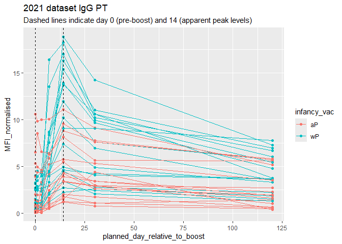

``` r
abdata.20 <- abdata %>% filter(dataset == "2020_dataset")

abdata.20 %>% 
  filter(isotype == "IgG",  antigen == "PT") %>%
  ggplot() +
    aes(x=planned_day_relative_to_boost,
        y=MFI_normalised,
        col=infancy_vac,
        group=subject_id) +
    geom_point() +
    geom_line() +
    geom_vline(xintercept=0, linetype="dashed") +
    geom_vline(xintercept=14, linetype="dashed") +
  labs(title="2020 dataset IgG PT",
       subtitle = "Dashed lines indicate day 0 (pre-boost) and 14 (apparent peak levels)")
```

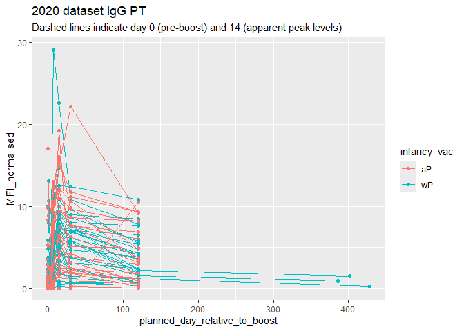

> Q18. Does this trend look similar for the 2020 dataset?

The trend in the 2021 dataset looks similar to the 2020 dataset. In both
datasets, IgG PT levels increase after the booster and reaches its peak
around day 14 before slowly decreasing over time. The wP group (teal)
generally shows higher responses than the aP group (red) in both
datasets. But the 2020 dataset shows more variation (more extreme
values) and includes some longer follow up time points (going up to 400
days). The 2021 dataset appears to have a more stable trajectory across
patients.

``` r
ggplot(pt.igg.21) +
  aes(planned_day_relative_to_boost, MFI_normalised, col = infancy_vac, group = subject_id) +
  geom_point() +
  geom_line() +
  geom_vline(xintercept =14, lty = 2)
```


## Obtaining CMI-PB RNASeq data

``` r
url <- "https://www.cmi-pb.org/api/v2/rnaseq?versioned_ensembl_gene_id=eq.ENSG00000211896.7"

rna <- read_json(url, simplifyVector = TRUE) 
```

``` r
#meta <- inner_join(specimen, subject)
ssrna <- inner_join(rna, meta)
```

    Joining with `by = join_by(specimen_id)`

> Q19. Make a plot of the time course of gene expression for IGHG1 gene
> (i.e. a plot of visit vs. tpm).

``` r
ggplot(ssrna) +
  aes(visit, tpm, group=subject_id) +
  geom_point() +
  geom_line(alpha=0.2)
```

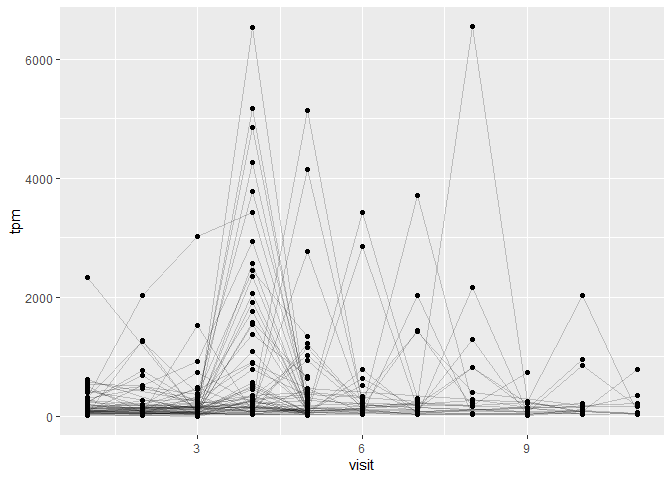

> Q20. What do you notice about the expression of this gene (i.e. when
> is it at it’s maximum level)?

The gene expression reaches its maximum level around visit 4. The gene
expression level is low in the beginning and then it increases
dramatically as shown around visit 4 and then it decreases around visits
5-7. It reaches its peak again around visit 8.

> Q21. Does this pattern in time match the trend of antibody titer data?
> If not, why not?

No, the pattern does not match the trend of antibody titer data. When
looking at the earlier antibody plots (PT and FIM2/3), the antibody
titers increase after vaccination and peak around the middle visits
(visit 5-7) but after the peak, they slowly decrease over time. When
looking at the gene expression plot, the gene expression level reaches
its peak around visit 4 but then it drops dramatically afterwards. This
shows that gene expression changes quickly and peaks earlier while
antibody titers increase more slowly and last longer. This is due to
gene expression representing early immune activation immediately after
vaccination while antibody titers represent the protein products of
immune cells which takes time to build up and remains in circulation
longer.

``` r
ggplot(ssrna) +
  aes(tpm, col=infancy_vac) +
  geom_boxplot() +
  facet_wrap(vars(visit))
```

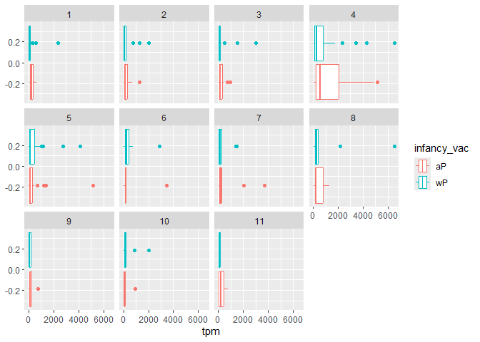

``` r
ssrna %>%  
  filter(visit==4) %>% 
  ggplot() +
    aes(tpm, col=infancy_vac) + geom_density() + 
    geom_rug() 
```

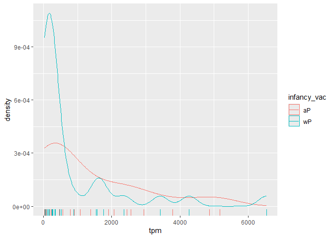

``` r
sessionInfo()
```

    R version 4.4.1 (2024-06-14 ucrt)
    Platform: x86_64-w64-mingw32/x64
    Running under: Windows 11 x64 (build 26200)

    Matrix products: default


    locale:
    [1] LC_COLLATE=English_United States.utf8 
    [2] LC_CTYPE=English_United States.utf8   
    [3] LC_MONETARY=English_United States.utf8
    [4] LC_NUMERIC=C                          
    [5] LC_TIME=English_United States.utf8    

    time zone: America/Los_Angeles
    tzcode source: internal

    attached base packages:
    [1] stats     graphics  grDevices utils     datasets  methods   base     

    other attached packages:
    [1] dplyr_1.2.0     lubridate_1.9.5 jsonlite_2.0.0  ggplot2_4.0.2  

    loaded via a namespace (and not attached):
     [1] vctrs_0.7.1        cli_3.6.5          knitr_1.51         rlang_1.1.7       
     [5] xfun_0.56          otel_0.2.0         generics_0.1.4     S7_0.2.1          
     [9] labeling_0.4.3     glue_1.8.0         htmltools_0.5.9    scales_1.4.0      
    [13] rmarkdown_2.30     grid_4.4.1         tibble_3.3.1       evaluate_1.0.5    
    [17] fastmap_1.2.0      yaml_2.3.12        lifecycle_1.0.5    compiler_4.4.1    
    [21] RColorBrewer_1.1-3 timechange_0.4.0   pkgconfig_2.0.3    rstudioapi_0.18.0 
    [25] farver_2.1.2       digest_0.6.39      R6_2.6.1           tidyselect_1.2.1  
    [29] pillar_1.11.1      magrittr_2.0.4     withr_3.0.2        tools_4.4.1       
    [33] gtable_0.3.6      
