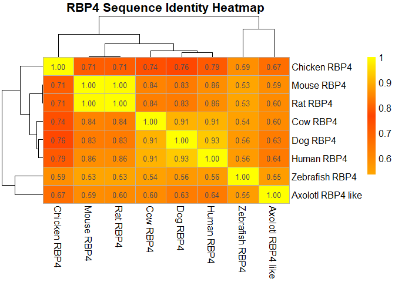

# heatmap


``` r
library(bio3d)
```

    Warning: package 'bio3d' was built under R version 4.4.3

``` r
library(pheatmap)
```

    Warning: package 'pheatmap' was built under R version 4.4.3

``` r
ali <- read.fasta("rbp4_clean.fasta")
x <- ali$ali

n <- nrow(x)
id.mat <- matrix(0, n, n)
rownames(id.mat) <- rownames(x)
colnames(id.mat) <- rownames(x)

for (i in 1:n) {
  for (j in 1:n) {
    id.mat[i, j] <- sum(x[i, ] == x[j, ]) / ncol(x)
  }
}

rownames(id.mat) <- gsub("_", " ", rownames(id.mat))
colnames(id.mat) <- gsub("_", " ", colnames(id.mat))

pdf("rbp4_heatmap1.pdf", width = 9, height = 8)

pheatmap(
  id.mat,
  display_numbers = TRUE,
  number_format = "%.2f",
  color = colorRampPalette(c("orange", "orangered", "yellow"))(100),
  cluster_rows = TRUE,
  cluster_cols = TRUE,
  border_color = "grey70",
  fontsize = 12,
  fontsize_number = 10,
  main = "RBP4 Sequence Identity Heatmap",
  angle_col = 270
)
```



``` r
dev.off()
```

    pdf 
      3 

``` r
library(bio3d)

ali <- read.fasta("rbp4_clean.fasta")

query <- paste(ali$ali["Human_RBP4", ], collapse = "")
query <- gsub("-", "", query)

bl <- blast.pdb(query)
```

     Searching ... please wait (updates every 5 seconds) RID = V8RG8SCK014 
     .....
     Reporting 41 hits

``` r
head(bl$hit)
```

            queryid subjectids identity alignmentlength mismatches gapopens q.start
    1 Query_7513247     4O9S_A   98.925             186          2        0      16
    2 Query_7513247     3FMZ_A   98.925             186          2        0      16
    3 Query_7513247     6QBA_A  100.000             183          0        0      19
    4 Query_7513247     1JYD_A  100.000             182          0        0      19
    5 Query_7513247     1BRP_A  100.000             182          0        0      19
    6 Query_7513247     1JYJ_A   98.901             182          2        0      19
      q.end s.start s.end    evalue bitscore positives mlog.evalue pdb.id    acc
    1   201      30   215 2.31e-139      389     98.92    319.2221 4O9S_A 4O9S_A
    2   201      27   212 2.67e-139      389     98.92    319.0772 3FMZ_A 3FMZ_A
    3   201       3   185 2.90e-138      385    100.00    316.6920 6QBA_A 6QBA_A
    4   200       2   183 1.16e-137      383    100.00    315.3057 1JYD_A 1JYD_A
    5   200       1   182 1.24e-137      383    100.00    315.2390 1BRP_A 1BRP_A
    6   200       2   183 1.14e-135      378     98.90    310.7180 1JYJ_A 1JYJ_A

``` r
unique_hits <- bl$hit[!duplicated(bl$hit$pdb.id), ]

top3 <- unique_hits[1:10, c("pdb.id", "identity", "evalue")]

top3
```

       pdb.id identity    evalue
    1  4O9S_A   98.925 2.31e-139
    2  3FMZ_A   98.925 2.67e-139
    3  6QBA_A  100.000 2.90e-138
    4  1JYD_A  100.000 1.16e-137
    5  1BRP_A  100.000 1.24e-137
    6  1JYJ_A   98.901 1.14e-135
    7  1QAB_E   98.333 3.22e-133
    8  3BSZ_E  100.000 4.23e-133
    9  2WQA_E   99.435 4.39e-133
    10 2WQ9_A  100.000 1.57e-131

``` r
ann <- pdb.annotate(top3$pdb.id)

ann[, c("structureId", "experimentalTechnique", "resolution", "source")]
```

           structureId experimentalTechnique resolution       source
    4O9S_A        4O9S                 X-ray       2.30 Homo sapiens
    3FMZ_A        3FMZ                 X-ray       2.90 Homo sapiens
    6QBA_A        6QBA                 X-ray       1.80 Homo sapiens
    1JYD_A        1JYD                 X-ray       1.70 Homo sapiens
    1BRP_A        1BRP                 X-ray       2.50 Homo sapiens
    1JYJ_A        1JYJ                 X-ray       2.00 Homo sapiens
    1QAB_E        1QAB                 X-ray       3.20 Homo sapiens
    3BSZ_E        3BSZ                 X-ray       3.38 Homo sapiens
    2WQA_E        2WQA                 X-ray       2.85 Homo sapiens
    2WQ9_A        2WQ9                 X-ray       1.65 Homo sapiens
